# Class Activity 1 — System Calls in Practice

- Student Name: Chum Kimchhun
- Student ID: p20240067
- Date: 3/20/2026

---

## Warm-Up: Hello System Call

## Task 1: File Creator & Reader
### Part A — File Creator
**Version A — Library Functions (`file_creator_lib.c`):**

<!-- Screenshot: gcc -o file_creator_lib file_creator_lib.c && ./file_creator_lib && cat output.txt -->
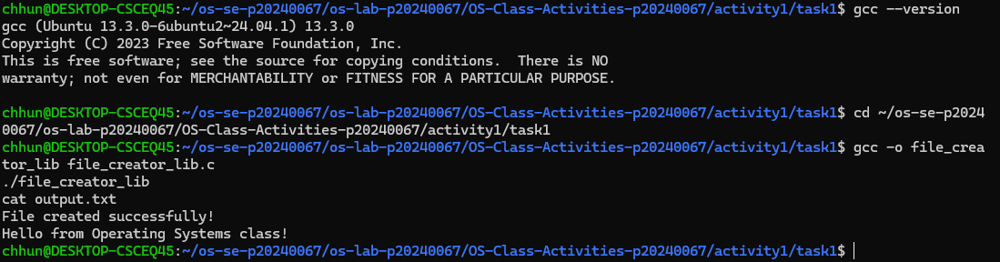

**Version B — POSIX System Calls (`file_creator_sys.c`):**

<!-- Screenshot: gcc -o file_creator_sys file_creator_sys.c && ./file_creator_sys && cat output.txt -->
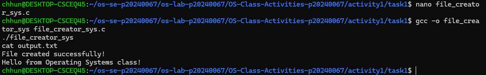

1. **What flags did you pass to `open()`? What does each flag mean?**

   > I used O_WRONLY | O_CREAT | O_TRUNC.

O_WRONLY: open the file for writing only 
O_CREAT: create the file if it does not exist 
O_TRUNC: clear the file content if it already exists

2. **What is `0644`? What does each digit represent?**

   > 0644 is the file permission.

0: special value (no special permission) 
6: owner can read and write (4 + 2) 
4: group can only read 
4: others can only read

3. **What does `fopen("output.txt", "w")` do internally that you had to do manually?**

   > fopen() internally calls system calls like open(), write(), and close().

fopen() internally calls system calls like open(), write(), and close().

It also handles buffering automatically, while in system calls we must do everything manually such as opening the file, writing data, and closing it.

### Part B — File Reader & Display
**Version A — Library Functions (`file_reader_lib.c`):**

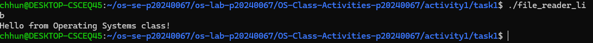

**Version B — POSIX System Calls (`file_reader_sys.c`):**

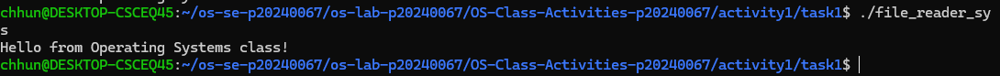
1. **What does `read()` return? How is this different from `fgets()`?**

   > read() returns the number of bytes read, or 0 if it reaches the end of file.

fgets() reads a line of text and returns a string, while read() works with raw bytes and does not handle lines automatically.

2. **Why do you need a loop when using `read()`? When does it stop?**

   > We need a loop because read() does not read the whole file at once.

The loop stops when read() returns 0, which means the end of the file is reached.

## Task 2: Directory Listing & File Info
### Version A — Library Functions (`dir_list_lib.c`)

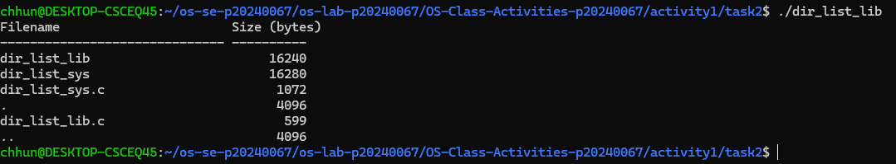

### Version B — System Calls (`dir_list_sys.c`)

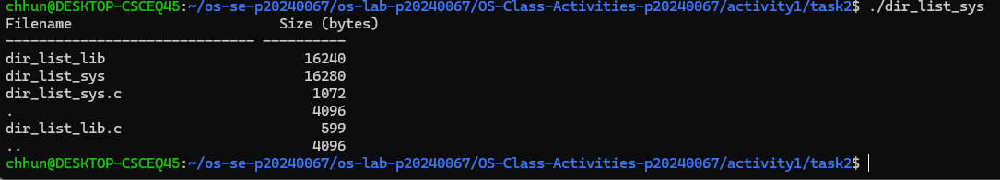
1. **What struct does `readdir()` return? What fields does it contain?**

   > readdir() returns a pointer to a struct dirent.

It contains fields such as:
- d_name: the file name
- d_ino: inode number
- d_type: file type

2. **What information does `stat()` provide beyond file size?**

   > stat() provides more information such as:
- file type
- permissions
- last modified time
- inode number

3. **Why can't you `write()` a number directly — why do you need `snprintf()` first?**

   > write() only works with bytes (characters), not numbers.

So we use snprintf() to convert numbers into a string before writing them to the terminal.

## Task 3: strace Analysis
### strace Output — Library Version (File Creator)

<!-- Screenshot: strace -e trace=openat,read,write,close ./file_creator_lib -->
<!-- IMPORTANT: Highlight/annotate the key system calls in your screenshot -->
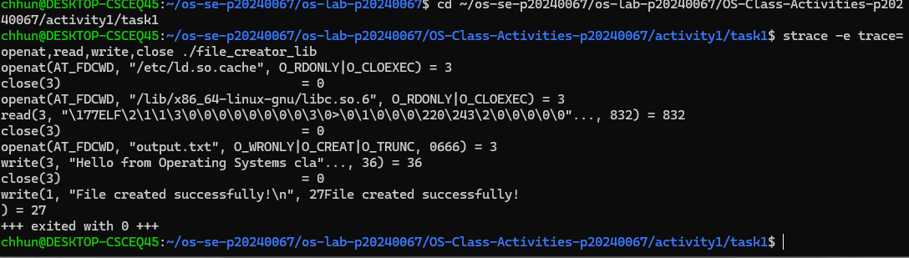

### strace Output — System Call Version (File Creator)

<!-- Screenshot: strace -e trace=openat,read,write,close ./file_creator_sys -->
<!-- IMPORTANT: Highlight/annotate the key system calls in your screenshot -->
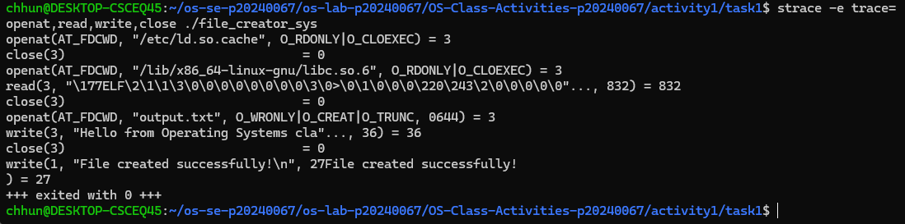

### strace Output — Library Version (File Reader or Dir Listing)

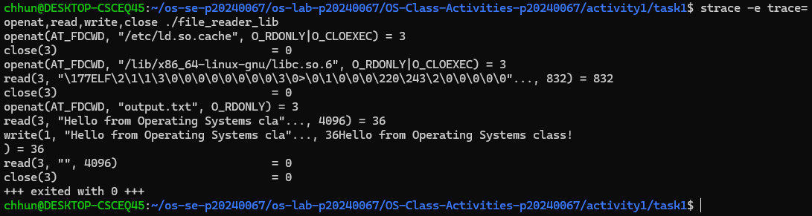

### strace Output — System Call Version (File Reader or Dir Listing)

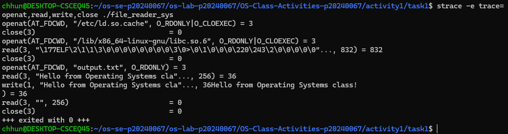

### strace -c Summary Comparison

<!-- Screenshot of `strace -c` output for both versions -->
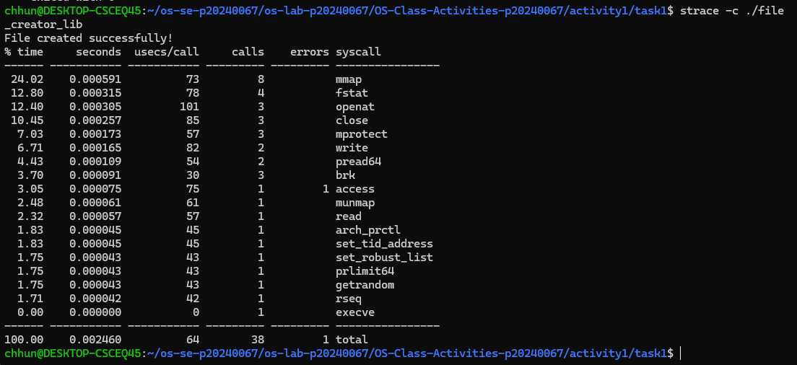
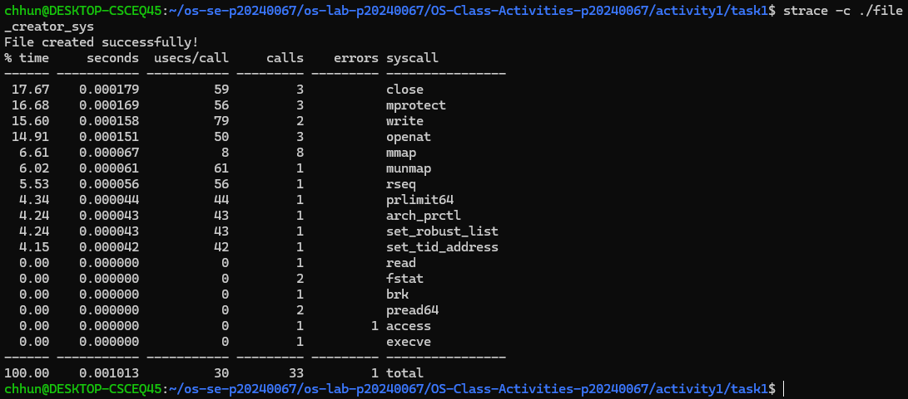
1. **How many system calls does the library version make compared to the system call version?**

   > The library version makes more system calls than the system call version.

From strace -c, I observed that the library version uses additional system calls, while the system call version only uses the necessary ones like open, write, and close.

2. **What extra system calls appear in the library version? What do they do?**

   > The library version includes extra system calls such as:
- brk: used for memory allocation
- mmap: used for memory mapping
- fstat: used to get file information
- access: checks file permissions

These are not directly used in the system call version.

3. **How many `write()` calls does `fprintf()` actually produce?**

   > fprintf() may not produce one write() per call.

Because of buffering, it may combine multiple outputs into fewer write() system calls.

4. **In your own words, what is the real difference between a library function and a system call?**

   > A system call directly interacts with the operating system kernel.

A library function is a higher-level function that may call one or more system calls internally and provides easier usage for programmers.

## Task 4: Exploring OS Structure
### System Information

> 📸 Screenshot of `uname -a`, `/proc/cpuinfo`, `/proc/meminfo`, `/proc/version`, `/proc/uptime`:

### Process Information

> 📸 Screenshot of `/proc/self/status`, `/proc/self/maps`, `ps aux`:

### Kernel Modules

> 📸 Screenshot of `lsmod` and `modinfo`:

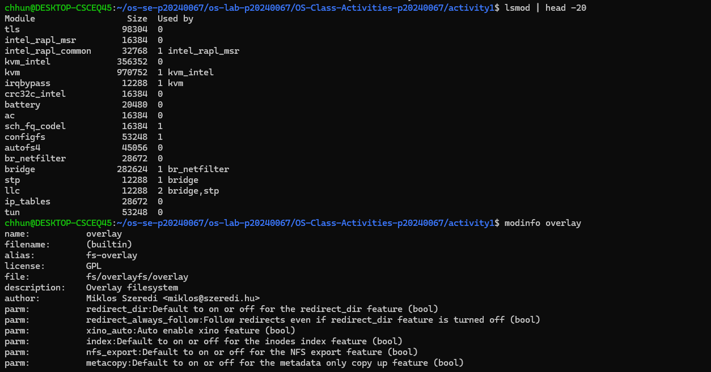

### OS Layers Diagram

> 📸 Your diagram of the OS layers, labeled with real data from your system:

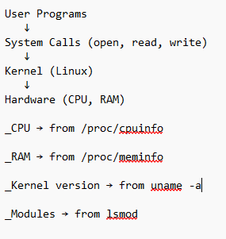
1. **What is `/proc`? Is it a real filesystem on disk?**

   > /proc is a virtual filesystem.

It is not stored on disk. The content is generated by the kernel in real time.

2. **Monolithic kernel vs. microkernel — which type does Linux use?**

   > Linux uses a monolithic kernel.

This is shown by lsmod because it supports loadable kernel modules.

3. **What memory regions do you see in `/proc/self/maps`?**

   > The memory regions include:
- heap
- stack
- shared libraries
- program code

4. **Break down the kernel version string from `uname -a`.**

   > The output shows:
- kernel name (Linux)
- hostname
- kernel version number
- build date
- system architecture (e.g., x86_64)

5. **How does `/proc` show that the OS is an intermediary between programs and hardware?**

   > /proc shows that the OS provides information between hardware and user programs.

User programs read system data from /proc, while the kernel collects data from hardware.

## Reflection
What did you learn from this activity? What was the most surprising difference between library functions and system calls?

> In this activity, I learned how system calls work and how they are different from library functions.

The most surprising part was that library functions use many hidden system calls, while system call programs are more direct and simple.

I also learned how Linux exposes system information through /proc, which shows how the OS connects user programs and hardware.
