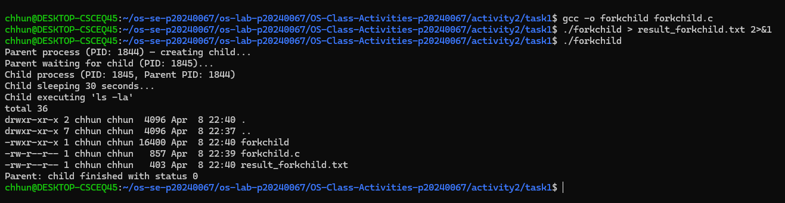
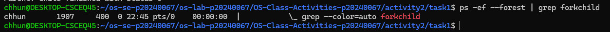
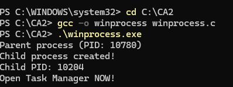
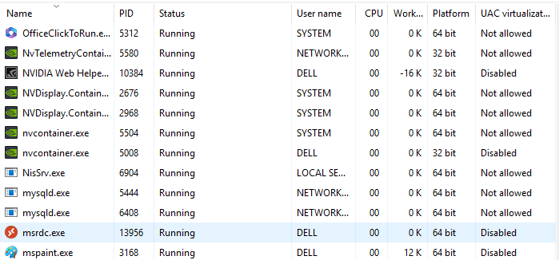
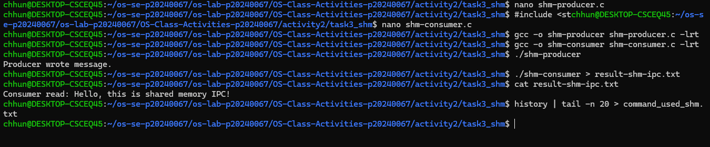
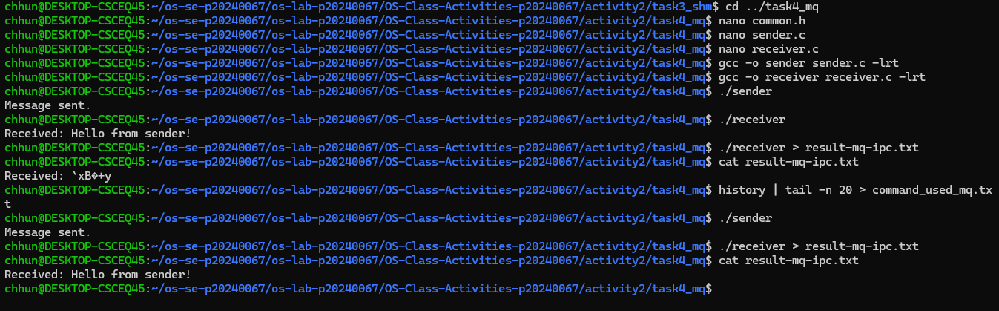

# Class Activity 2 — Processes & Inter-Process Communication

* **Student Name:** Chum kimchhun
* **Student ID:** p20240067
* **Date:** April 09 2026

---

## Task 1: Process Creation on Linux (fork + exec)

### Compilation & Execution



### Process Tree



### Output

```
cat task1/result_forkchild.txt
total 32
drwxr-xr-x 2 chhun chhun  4096 Apr  8 22:40 .
drwxr-xr-x 7 chhun chhun  4096 Apr  8 22:37 ..
-rwxr-xr-x 1 chhun chhun 16400 Apr  8 22:40 forkchild
-rw-r--r-- 1 chhun chhun   857 Apr  8 22:39 forkchild.c
-rw-r--r-- 1 chhun chhun     0 Apr  8 22:40 result_forkchild.txt
Parent process (PID: 1760) — creating child...
Parent waiting for child (PID: 1761)...
Parent: child finished with status 0

```

### Questions

1. **What does `fork()` return to the parent? What does it return to the child?**

   > `fork()` returns the child PID to the parent process, and returns 0 to the child process.

2. **What happens if you remove the `waitpid()` call? Why might the output look different?**

   > The parent will not wait for the child and may finish first. This can cause mixed or out-of-order output and may create a zombie process temporarily.

3. **What does `execlp()` do? Why don't we see "execlp failed" when it succeeds?**

   > `execlp()` replaces the current process with a new program (like `ls`). If it succeeds, the original code is replaced, so the error message is never executed.

4. **Draw the process tree for your program (parent → child). Include PIDs from your output.**

   > forkchild(Parent PID)
   > └── forkchild(Child PID)

5. **Which command did you use to view the process tree? What information does each column show?**

   > I used `ps -ef --forest`. It shows user, PID, PPID, CPU usage, terminal, time, and command.

---

## Task 2: Process Creation on Windows

### Compilation & Execution



### Task Manager Screenshots




### Questions

1. **What is the key difference between Linux and Windows process creation?**

   > Linux uses `fork()` to copy the process and `exec()` to run a new program. Windows uses `CreateProcess()` to do both in one step.

2. **What does `WaitForSingleObject()` do? What is its Linux equivalent?**

   > It waits for a process to finish. The Linux equivalent is `wait()` or `waitpid()`.

3. **Why do we need to call `CloseHandle()`?**

   > It releases system resources. Without it, memory leaks may occur.

4. **Do the PIDs match Task Manager?**

   > Yes, the PID shown in the program matches the one in Task Manager.

5. **Which view is easier?**

   > The Processes tab is easier because it visually shows parent-child relationships.

---

## Task 3: Shared Memory IPC

### Compilation & Execution



### Output

```
cat task3_shm/result-shm-ipc.txt
Consumer read: Hello, this is shared memory IPC!
```

### Questions

1. **What does `shm_open()` do?**

   > It creates or opens a shared memory object, similar to opening a file.

2. **What does `mmap()` do?**

   > It maps shared memory into the process address space. It is faster because no copying is needed.

3. **Why must the name match?**

   > Both processes must access the same memory region.

4. **What does `shm_unlink()` do?**

   > It removes the shared memory. Without it, memory stays allocated.

5. **What happens if consumer runs first?**

   > It fails with an error because the shared memory does not exist yet.

---

## Task 4: Message Queue IPC

### Compilation & Execution



### Output

```
[Paste your result-mq-ipc.txt content here]
```

### Questions

1. **Difference between message queue and shared memory?**

   > Shared memory is faster but needs synchronization. Message queues are easier and structured.

2. **Why must queue name start with `/`?**

   > POSIX requires queue names to begin with `/`.

3. **What does `mq_unlink()` do?**

   > It deletes the queue. Without it, the queue remains in the system.

4. **What happens if receiver runs first?**

   > It shows an error because the queue is not created yet.

5. **Multiple senders/receivers?**

   > Yes, multiple processes can send and receive from the same queue.

---

## Reflection

This activity helped me understand how processes are created differently in Linux and Windows. The most interesting part was seeing how `fork()` creates a duplicate process while Windows uses a single function. I also learned that shared memory is very fast but requires careful handling, while message queues are easier but slightly slower. Overall, this activity improved my understanding of process management and IPC.
