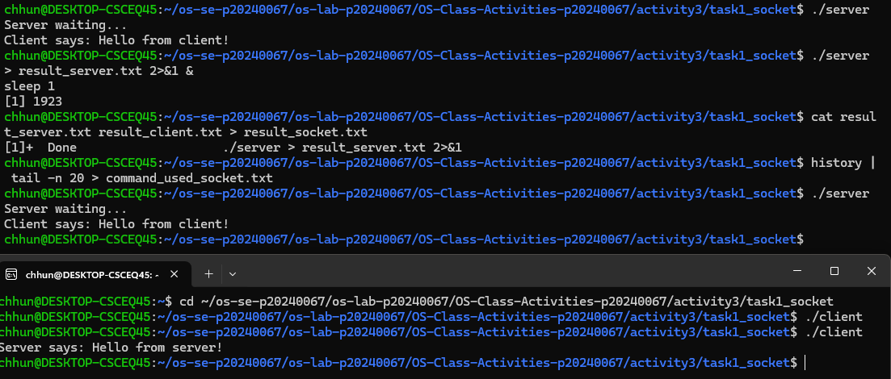
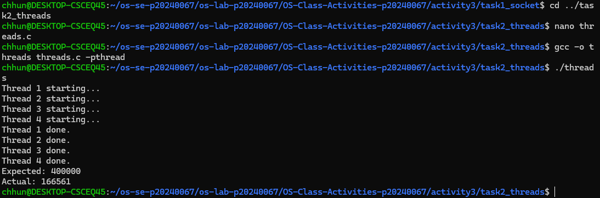
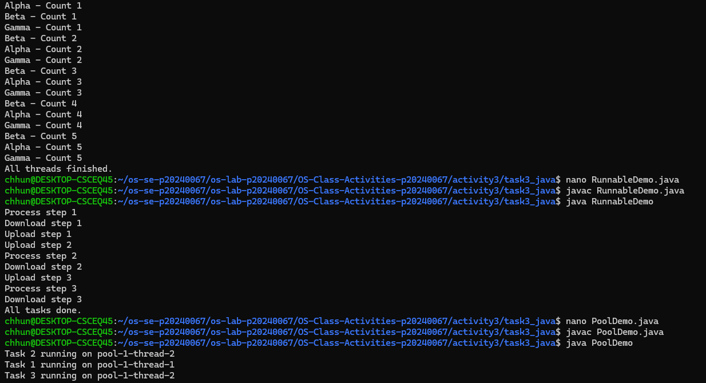
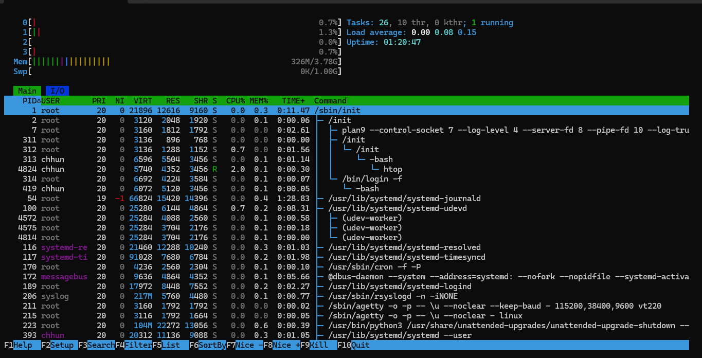
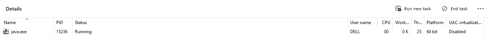

# Class Activity 3 — Socket Communication & Multithreading

* **Student Name:** Chum Kimchhun
* **Student ID:** p20240067
* **Date:** April 2026

---

## Task 1: TCP Socket Communication (C)

### Compilation & Execution



### Answers

1. **Role of `bind()` / Why client doesn't call it:**

`bind()` is used by the server to attach the socket to a specific IP address and port number so that clients know where to connect.
The client does not call `bind()` because the OS automatically assigns a temporary port when it connects to the server.

---

2. **What `accept()` returns:**

`accept()` returns a new socket file descriptor that is used for communication with the client.
It is different from the original server socket because the original socket is only used for listening, while the new socket is used for sending and receiving data.

---

3. **Starting client before server:**

If the client is started before the server, it will fail to connect and show an error like:

```
connect: Connection refused
```

This happens because no server is listening on that port yet.

---

4. **What `htons()` does:**

`htons()` converts a port number from host byte order to network byte order.
This is needed because different systems use different byte orders, and network communication requires a standard format.

---

5. **Socket call sequence diagram:**

Server:

```
socket() → bind() → listen() → accept() → read() → send() → close()
```

Client:

```
socket() → connect() → send() → read() → close()
```

---

## Task 2: POSIX Threads (C)

### Output — Without Mutex (Race Condition)



### Output — With Mutex (Correct)

*(Included in same screenshot or separately)*

### Answers

1. **What is a race condition?**

A race condition happens when multiple threads access and modify shared data at the same time without proper control.
In `threads.c`, all threads update `shared_counter` at the same time, causing incorrect results.

---

2. **What does `pthread_mutex_lock()` do?**

`pthread_mutex_lock()` ensures that only one thread can access the shared variable at a time.
It prevents other threads from entering the critical section until the lock is released, which fixes the race condition.

---

3. **Removing `pthread_join()`:**

If `pthread_join()` is removed, the main thread may finish before the worker threads complete.
This can cause incomplete output or the program ending early.

---

4. **Thread vs Process:**

* A **process** is an independent program with its own memory space.
* A **thread** is a smaller unit inside a process that shares memory with other threads.

Shared by threads:

* Code
* Data
* Heap

Private to each thread:

* Stack
* Registers

---

## Task 3: Java Multithreading

### ThreadDemo Output



### RunnableDemo Output

*(Included screenshot or output file)*

### PoolDemo Output

*(Included screenshot or output file)*

### Answers

1. **Thread vs Runnable:**

* `Thread` is a class that you extend to create a thread.
* `Runnable` is an interface that you implement.

`Runnable` is preferred because Java does not support multiple inheritance, so it is more flexible.

---

2. **Pool size limiting concurrency:**

Only 2 tasks run at the same time because the thread pool is created with size 2.
Other tasks wait in a queue until a thread becomes available.

---

3. **thread.join() in Java:**

`join()` makes the main thread wait until the other threads finish.
If it is removed, the main thread may finish earlier and not wait for all threads.

---

4. **ExecutorService advantages:**

`ExecutorService` is better because it manages threads efficiently, reuses them, and avoids creating too many threads manually.
It also makes the code cleaner and easier to manage.

---

## Task 4: Observing Threads

### Linux — `ps -eLf` Output

chhun       4716     313    4716  0    5 19:47 pts/0    00:00:00 ./threads_observe
chhun       4716     313    4717  0    5 19:47 pts/0    00:00:00 ./threads_observe
chhun       4716     313    4718  0    5 19:47 pts/0    00:00:00 ./threads_observe
chhun       4716     313    4719  0    5 19:47 pts/0    00:00:00 ./threads_observe
chhun       4716     313    4720  0    5 19:47 pts/0    00:00:00 ./threads_observe
chhun       4739     313    4739  0    1 19:48 pts/0    00:00:00 grep --color=auto threads_observe
    PID    SPID TTY          TIME CMD
   4716    4716 pts/0    00:00:00 threads_observe
   4716    4717 pts/0    00:00:00 threads_observe
   4716    4718 pts/0    00:00:00 threads_observe
   4716    4719 pts/0    00:00:00 threads_observe
   4716    4720 pts/0    00:00:00 threads_observe
--- /proc task ---
4716
4717
4718
4719
4720


---

### Linux — htop Thread View



---

### Windows — Task Manager



---

### Answers

1. **LWP column meaning:**

LWP stands for Light Weight Process.
It represents individual threads inside a process. Each thread has its own LWP ID.

---

2. **/proc/PID/task/ count:**

The number of entries in `/proc/<PID>/task/` represents the number of threads.
It should match the number of threads created in the program, including the main thread.

---

3. **Extra Java threads:**

Java creates additional internal threads for garbage collection, memory management, and JVM operations.
That is why more threads are shown than the ones created manually.

---

4. **Linux vs Windows thread viewing:**

Linux provides more detailed information using commands like `ps` and `/proc`.
Windows Task Manager is easier to use but shows less technical detail.

---

## Reflection

This activity helped me understand how processes communicate using sockets and how threads work inside a program.
I found it interesting to see how multiple threads run at the same time and how race conditions can happen.
Observing threads using system tools like `ps` and Task Manager helped me understand how the OS manages threads.
This knowledge is useful for writing better and safer concurrent programs in the future.

---
