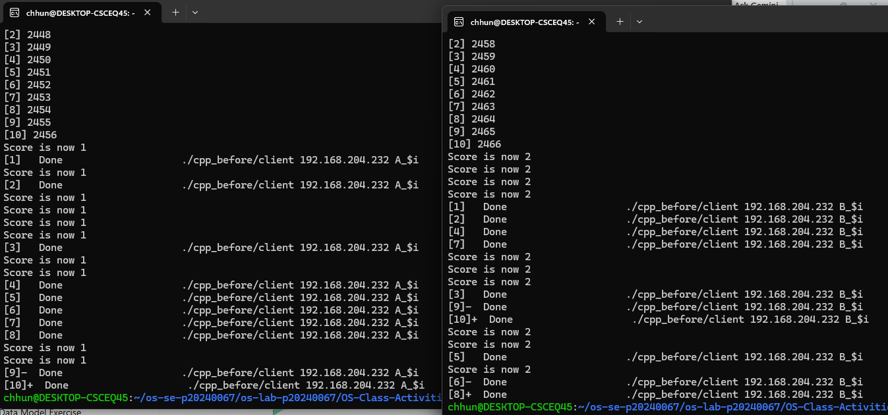
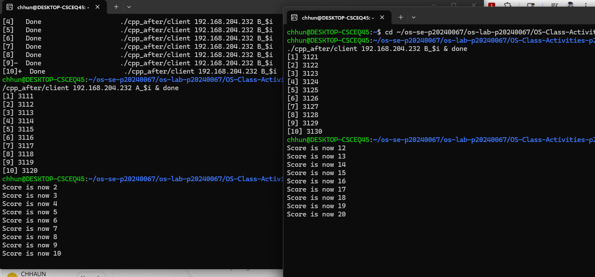
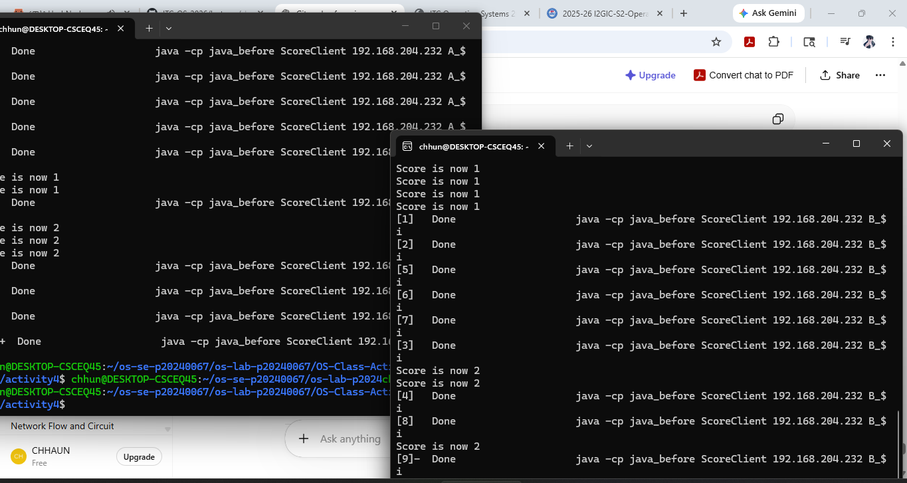
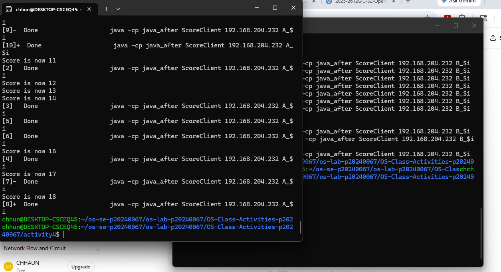

# Class Activity 4 — Shared File API

- **Student Name:** Chum Kimchhun
- **Student ID:** p20240067
- **Partner Name:** [Partner Name]
- **Partner Student ID:** [Partner ID]
- **Server Machine Owner:** Chum Kimchhun
- **Server IP Address:** 192.168.128.164

---

## Task 1: C++ Before Mutex

- Expected score after 20 total client requests: 20
- Actual score: 1
- What happened:
  Multiple threads updated the file at the same time without synchronization, causing a race condition and incorrect final score.

---

## Task 2: C++ After Mutex

- Expected score after 20 total client requests: 20
- Actual score: 20
- What changed after adding mutex:
  The mutex allowed only one thread to access the shared file at a time, preventing race conditions.

---

## Task 3: Java Before Synchronized

- Expected score after 20 total client requests: 20
- Actual score: [Your Result]
- What happened:
  Multiple Java threads accessed the file simultaneously without synchronization, causing inconsistent results.

---

## Task 4: Java After Synchronized

- Expected score after 20 total client requests: 20
- Actual score: 20
- What changed after adding synchronized:
  The synchronized method protected the file update so only one thread modified the file at a time.

---

## Questions

1. Why should clients send requests to the server instead of writing the file directly?

   Clients should send requests to the server because the server can control access to the shared file and reduce conflicts between multiple users.

2. Why does the server still have a race condition before mutex or synchronized?

   The server creates multiple threads for different clients. Without synchronization, several threads may update the file at the same time.

3. In the C++ fixed version, what does `std::lock_guard<std::mutex>` protect?

   It protects the critical section where the shared file is read and updated.

4. In the Java fixed version, what does `synchronized` protect?

   It ensures that only one thread can execute the update method at one time.

5. Why is the final score expected to be 20 when Student A sends 10 requests and Student B sends 10 requests?

   Because each request increases the score by 1, so 10 + 10 = 20 total updates.

6. What could happen if two separate servers update the same file at the same time?

   The file could become corrupted or contain incorrect data because both servers may overwrite each other’s changes.

---

## Reflection

This activity taught me how race conditions happen when multiple threads access shared resources simultaneously. C++ uses mutex with lock_guard while Java uses synchronized methods. Both approaches protect critical sections and ensure correct file updates.
