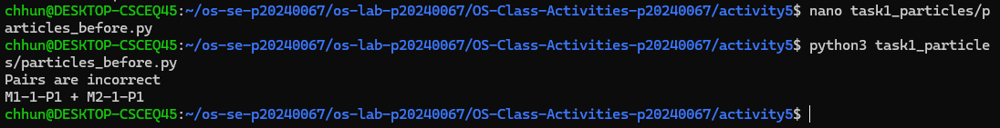
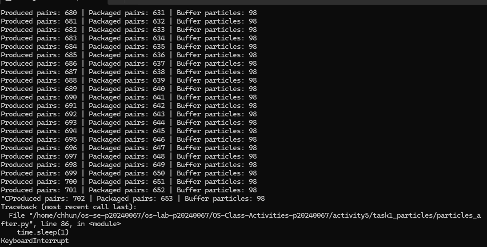
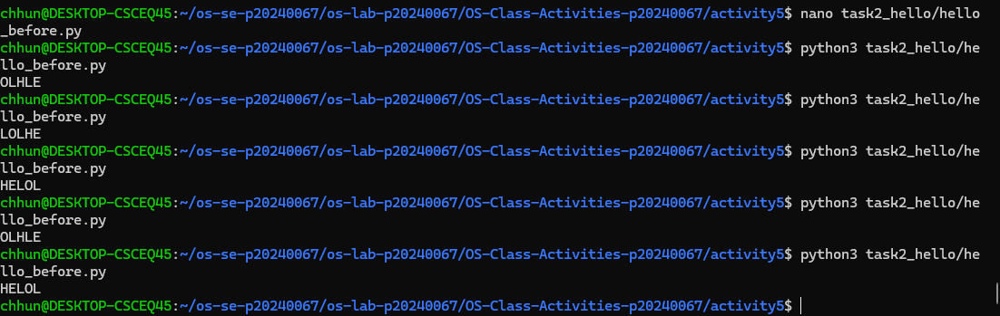
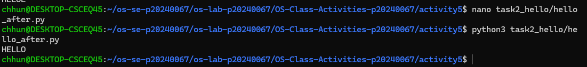

# Class Activity 5 - Semaphores

* **Student Name:** Chum Kimchhun
* **Student ID:** P20240067
* **Programming Language Used:** Python 3

---

## Task 1A: Particle Pair Buffer Before Semaphores

* What error or incorrect behavior appeared:

  * The program eventually displayed "Pairs are incorrect".
* Why did this happen without semaphore protection:

  * Multiple producer threads modified the shared buffer simultaneously, causing particles from different pairs to become mixed.

---

## Task 1B: Particle Pair Buffer After Semaphores

* Number of producer machines: 3
* Buffer capacity: 100 particles (50 pairs)
* Semaphores used:

  * mutex
  * empty_pairs
  * full_pairs
* Produced pair count shown in screenshot: Visible in screenshot
* Packaged pair count shown in screenshot: Visible in screenshot
* Did any error appear during normal operation?

  * No. The simulation ran continuously without errors.

---

## Task 2A: HELLO Before Semaphores

* Output before semaphore ordering:

  * Example: OLHEL
* Why this output can be wrong or unpredictable:

  * Thread scheduling is controlled by the operating system, so concurrent threads may execute in different orders.

---

## Task 2B: HELLO After Semaphores

* Processes or threads used:

  * Three threads
* Semaphores used:

  * after_e
  * after_l
* Final output:

  * HELLO

---

## Questions

### 1. In Task 1, why does a producer need to wait before adding a pair to the buffer?

A producer must wait when there is no available space in the buffer. This prevents buffer overflow.

### 2. In Task 1, why does the consumer need to wait before removing a pair from the buffer?

The consumer must wait until at least one complete pair exists. This prevents buffer underflow.

### 3. Which semaphore protects the critical section in your particle buffer program?

The mutex semaphore protects the critical section.

### 4. How does your program verify that P1 and P2 belong to the same pair?

The program compares the machine ID and pair ID portions of both particles. If they differ, the pair is invalid.

### 5. In Task 2, why can the program print letters in the wrong order without semaphores?

Because the operating system schedules threads independently, causing nondeterministic execution order.

### 6. Which semaphore or synchronization step forces H to print before E, L, L, and O?

The after_e semaphore ensures Process 2 waits until HE has been printed. The after_l semaphore ensures O is printed only after LL.

### 7. What could cause deadlock in either of your simulations?

Deadlock could occur if a thread acquires a semaphore and never releases it, causing other threads to wait forever.

---

## Reflection

This activity demonstrated how semaphores solve two important synchronization problems. In the particle buffer simulation, semaphores prevented race conditions and protected shared resources. In the HELLO simulation, semaphores enforced execution order among concurrent threads. The activity showed that correct synchronization is essential for both resource management and process coordination.
