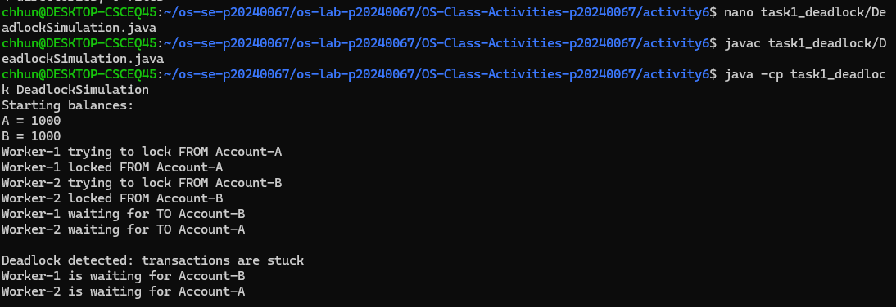
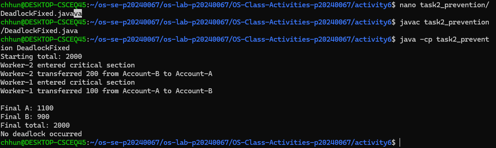

# Class Activity 6 - Deadlock Simulation

* **Student Name:** Chum Kimchhun
* **Student ID:** p20240067
* **Programming Language Used:** Java

---

## Task 1: Deadlock Version

* Shared resources: Account-A and Account-B
* Transaction 1: Transfer 100 from Account-A to Account-B
* Transaction 2: Transfer 200 from Account-B to Account-A
* Deadlock message shown: Deadlock detected: transactions are stuck
* Explanation of why the program got stuck:

Worker-1 locked Account-A and waited for Account-B. Worker-2 locked Account-B and waited for Account-A. Since both workers were waiting for each other to release a lock, neither could continue and the program entered a deadlock state.

---

## Task 2: Deadlock Prevention Version

* Prevention strategy used: One shared semaphore mutex protecting the entire transfer operation
* Semaphore mutex initial value: 1
* Starting total: 2000
* Final total: 2000
* Did both transfers complete? Yes
* Why no deadlock occurred:

Only one thread could enter the critical section at a time. Therefore, no thread could hold one resource while waiting for another resource, eliminating the circular wait condition.

---

## Questions

### 1. What are the two shared resources in your bank transaction simulation?

The two shared resources are Account-A and Account-B.

### 2. Which line or section of your Task 1 program creates hold-and-wait?

After a thread acquires the first account lock and then waits to acquire the second account lock.

### 3. How does Task 1 create circular wait?

Worker-1 waits for Account-B while holding Account-A. Worker-2 waits for Account-A while holding Account-B. This creates a circular dependency.

### 4. Why does the Task 1 program need a watchdog or timeout?

Without a watchdog, the program would simply freeze and provide no indication that a deadlock occurred.

### 5. How does the single semaphore mutex prevent deadlock in Task 2?

The mutex allows only one transfer thread to execute the transfer code at a time, preventing competing lock requests.

### 6. Which of the four deadlock conditions does your Task 2 solution remove or avoid?

The solution removes the hold-and-wait condition and prevents circular wait.

### 7. Why must the final total bank balance remain unchanged after both transfers?

Money is only transferred between accounts and is neither created nor destroyed. Therefore, the total balance must remain constant.

---

## Reflection

This activity demonstrated how deadlocks occur when multiple threads compete for shared resources in different orders. Using a semaphore mutex simplified synchronization and prevented deadlock by ensuring only one transaction could access shared resources at a time. Similar techniques are used in banking systems, databases, and operating systems to maintain consistency and avoid system freezes.
