# Class Activity 7 - Reasoning About Deadlock

* **Student Name:** CHHAUN
* **Student ID:** P20240067
* **Linux Username:** chhun
* **My personalization:** a = 7, b = 6

---

# Task 1 — Resource Allocation Graphs

## Part A

### Graph 1 — My Prediction

There is a cycle in the graph, so the system is deadlocked. The cycle is:

**P0 → R1 → P1 → R2 → P2 → R0 → P0**

Since each resource has only one instance, none of the processes can continue.

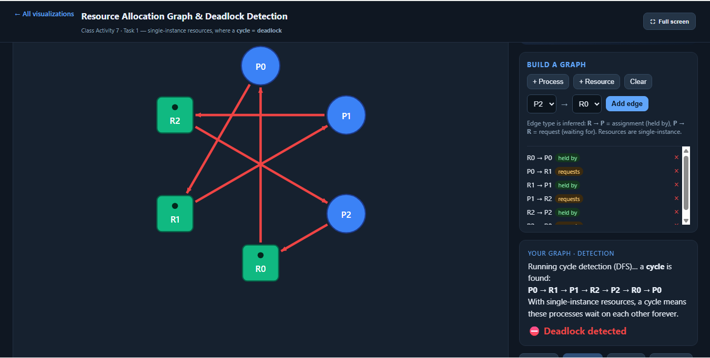

**Matched the tool?**

Yes. The tool detected the same deadlock cycle.

---

### Graph 2 — My Prediction

There is no cycle, so the system is **not deadlocked**.

P2 can finish first because it is not waiting for any resource. After P2 releases R2, P1 can continue, then P0.

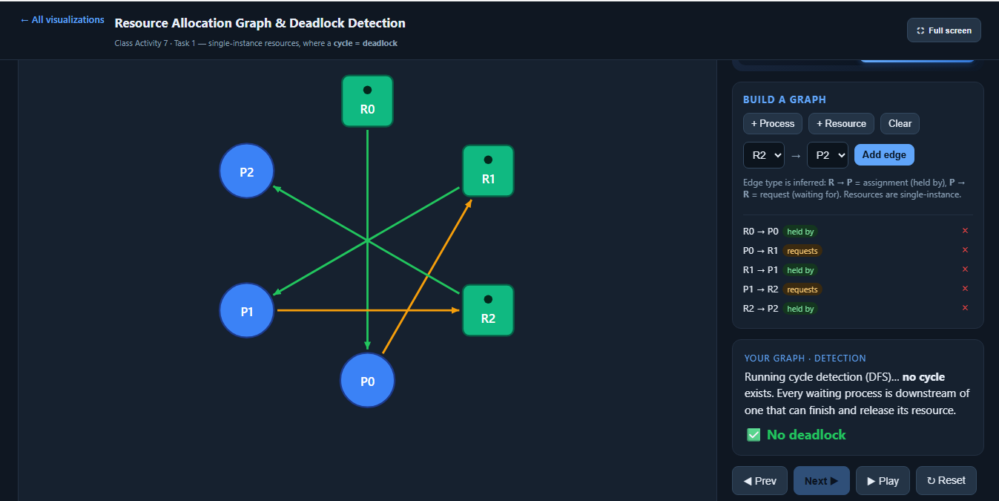

**Matched the tool?**

Yes. The tool confirmed there was no deadlock.

---

## Part B

### (i) Deadlocked 3×3 Graph

I created three processes and three resources with the following cycle:

* R0 → P0
* P0 → R1
* R1 → P1
* P1 → R2
* R2 → P2
* P2 → R0

This forms a circular wait involving all three processes, so the graph is deadlocked.

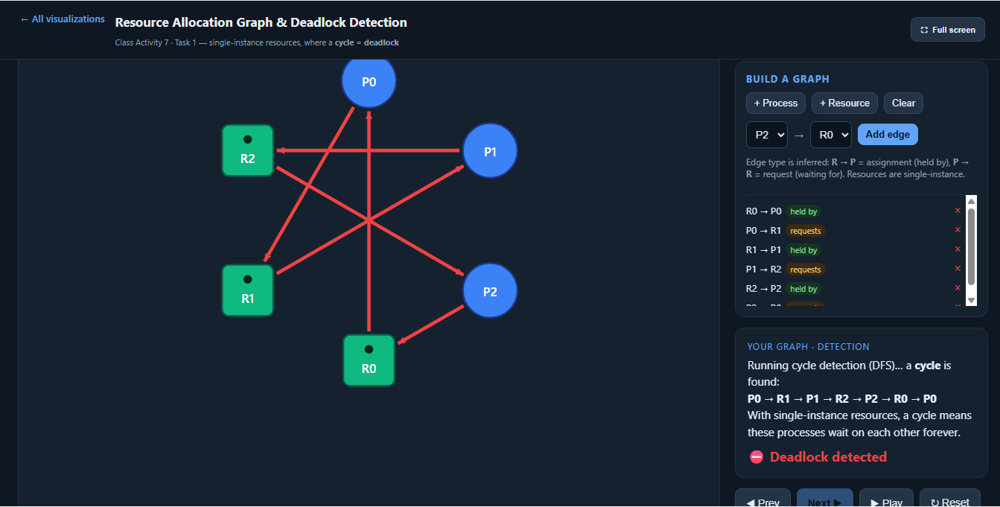

---

### (ii) No-Cycle Graph

I created a graph with four nodes where one process waits for a resource, but no cycle exists.

For example:

* R0 → P0
* P1 → R0

Since P0 can finish and release R0, P1 can continue. Therefore the graph is deadlock-free.

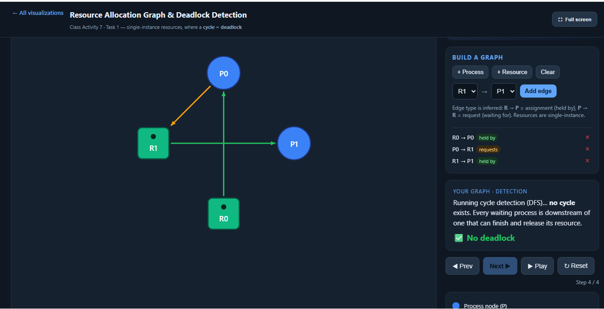

---

# Task 2 — Cycle ≠ Deadlock

## Warm-up (Built-in Examples)

### 1. Why the "Cycle, NO Deadlock" example is not deadlocked

Although a cycle exists, one resource has an extra available instance. A process can still obtain that resource, finish, and release its resources. Once it finishes, the remaining processes can also complete.

### 2. The single change that causes deadlock

The spare instance is removed (or all instances become allocated). No process can obtain the resource it needs, so none can start the reduction process, causing deadlock.

---

## Part A — Given Scenario

### Available

Total resources:

* R1 = 2
* R2 = 1
* R3 = 2

Allocation totals:

* R1 = 1 + 0 + 1 = 2
* R2 = 0 + 1 + 0 = 1
* R3 = 0 + 1 + 1 = 2

Available = Total − Allocation

Available = (2−2, 1−1, 2−2)

**Available = (0,0,0)**

---

### Cycle

The cycle is

**P1 → R2 → P2 → R1 → P1**

P3 is also part of the system but has no outstanding request, so it can finish immediately and release its resources.

| Step | Process | Why Request ≤ Work | Work after release |
| ---- | ------- | ------------------ | ------------------ |
| 1    | P3      | Request = (0,0,0)  | (1,0,1)            |
| 2    | P2      | Request ≤ Work     | (1,1,2)            |
| 3    | P1      | Request ≤ Work     | (2,1,2)            |

**Conclusion**

The system is **NOT deadlocked**.

Safe finishing order:

**P3 → P2 → P1**

---

### After changing P3's request to (0,1,0)

Prediction:

The system becomes deadlocked because P3 now also waits for R2. No process has Request ≤ Work, so the reduction cannot begin.

---

## Part B — My Own Scenario

I created a scenario with multiple instances where a cycle exists but one spare resource instance allows one process to finish first.

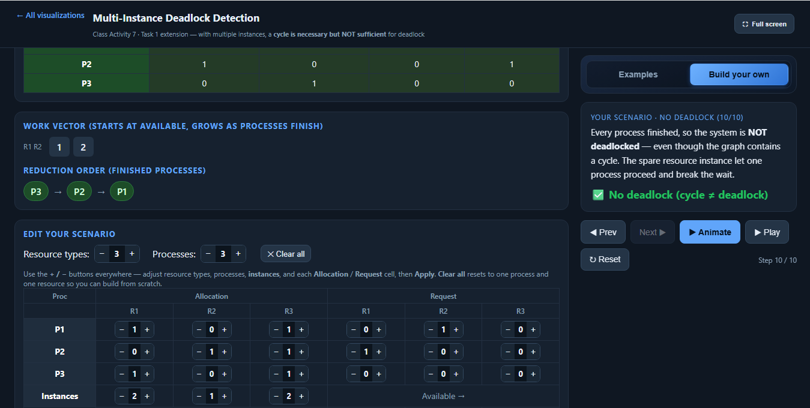

I then removed the spare instance, which prevented any process from satisfying Request ≤ Work. The system became deadlocked.

---

# Task 3 — Banker's Algorithm (My Personalized Scenario)

My student ID is **P20240067**

* **a = 7**
* **b = 6**

Therefore,

* Max[P0][A] = 7 + (7 mod 3) = **8**
* Max[P2][C] = 2 + (6 mod 4) = **4**

---

## Max Matrix

| Process | A | B | C |
| ------- | - | - | - |
| P0      | 8 | 5 | 3 |
| P1      | 3 | 2 | 2 |
| P2      | 9 | 0 | 4 |

---

## Need Matrix

Need = Max − Allocation

| Process | A | B | C |
| ------- | - | - | - |
| P0      | 8 | 4 | 3 |
| P1      | 1 | 2 | 2 |
| P2      | 6 | 0 | 2 |

---

## Available

Total Resources

* A = 10
* B = 5
* C = 7

Allocated

* A = 0 + 2 + 3 = 5
* B = 1 + 0 + 0 = 1
* C = 0 + 0 + 2 = 2

Available

**(10−5, 5−1, 7−2) = (5,4,5)**

---

## Safety Trace (By Hand)

| Step | Process | Why Need ≤ Work    | Work after release |
| ---- | ------- | ------------------ | ------------------ |
| 1    | P1      | (1,2,2) ≤ (5,4,5)  | (7,4,5)            |
| 2    | P2      | (6,0,2) ≤ (7,4,5)  | (10,4,7)           |
| 3    | P0      | (8,4,3) ≤ (10,4,7) | (10,5,7)           |

### Conclusion

The system is **SAFE**.

One valid safe sequence is:

**P1 → P2 → P0**

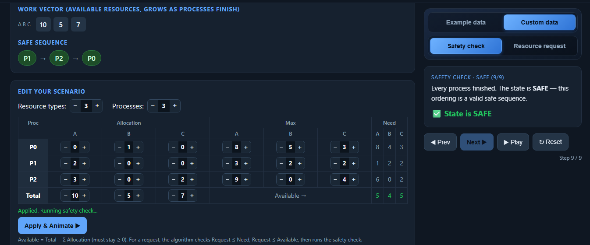

The tool confirmed my result. A different safe sequence would also be correct if every process can finish.

---

## Request I Predicted to be GRANTED

Process:

**P1 requests (1,0,1)**

Checks:

* Request ≤ Need ✔
* Request ≤ Available ✔
* Tentative allocation remains safe ✔

Therefore the request is **GRANTED**.

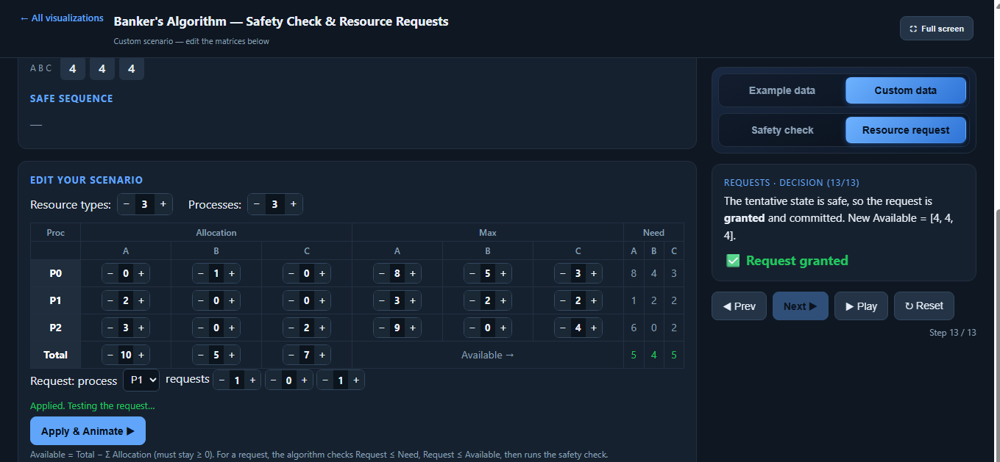

---

## Request I Predicted to be DENIED

Process:

**P0 requests (6,0,0)**

Checks:

* Request ≤ Need ✔
* Request ≤ Available ✘

Only 5 units of resource A are available, but P0 requests 6 units.

Therefore the request is **DENIED**.

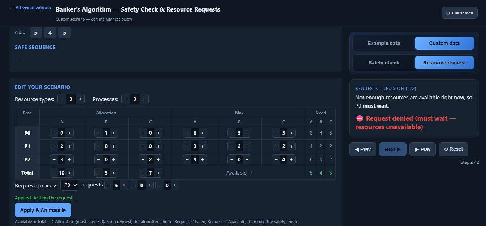
## Task 4 — Semaphores and Deadlock

### Case 1 (s1=s2=s3=1)

**My prediction:** **YES**, this system can deadlock.

Possible interleaving:

- P1 acquires `s1`, then waits for `s2`.
- P2 acquires `s2`, then waits for `s3`.
- P3 waits for `s1`.

Wait-for cycle:

`P1 → s2 → P2 → s3`

Since P2 is waiting for `s3` while P1 is waiting for `s2`, the system can become blocked with no process able to continue.

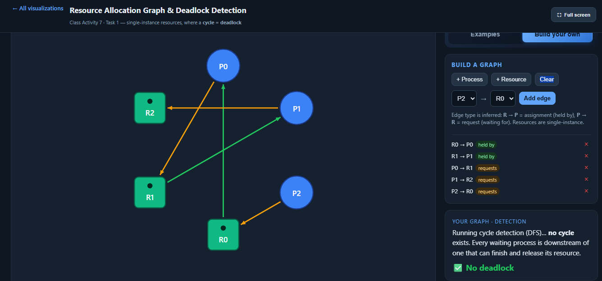

**Matched the tool?**

Yes. The tool confirmed that a deadlock is reachable.

---

### Case 2 (s1=s2=s3=1)

**My prediction:** **YES**, this system can deadlock.

Possible interleaving:

- P1 acquires `s1` and waits for `s2`.
- P2 acquires `s2` and waits for `s3`.
- P3 waits for `s2`, then `s3`, then `s1`.

Wait-for cycle:

`P1 → s2 → P2 → s3 → P3 → s1 → P1`

Each process is waiting for a semaphore held by another process, creating a circular wait.

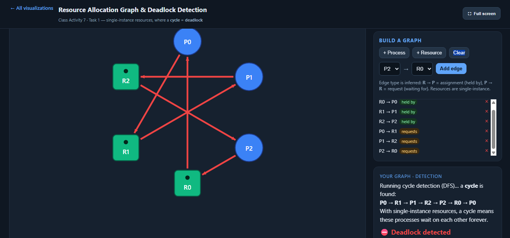

**Matched the tool?**

Yes. The tool confirmed the deadlock.

---

### Case 3 (s1=2, s2=1, s3=1)

**My prediction:** **NO**, this system cannot deadlock.

The extra instance of `s1` allows another process to acquire it without blocking immediately. This breaks the circular wait because P3 can continue instead of waiting for P1 to release `s1`.

Therefore, all processes are eventually able to finish.

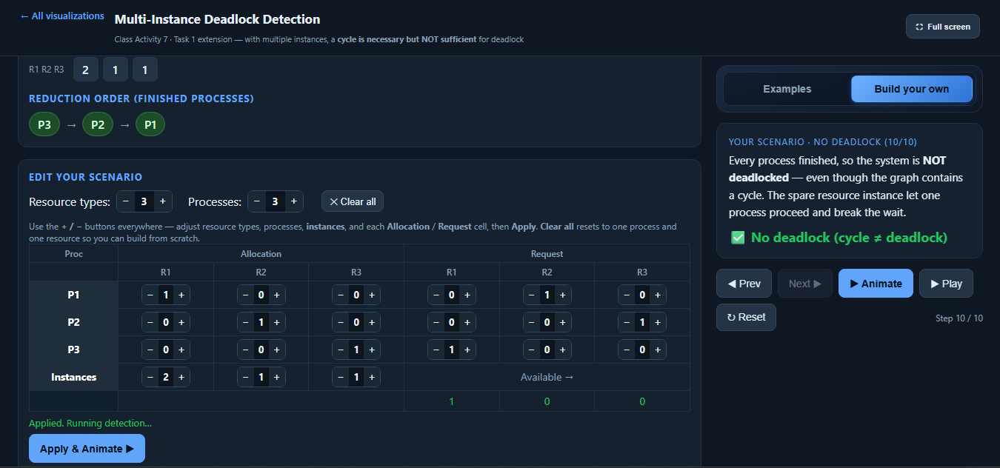

**Matched the tool?**

Yes. The tool confirmed that no deadlock occurs because the additional instance of `s1` prevents the circular wait.
---

## Task 5 — Applied Concepts

### 1. State the four necessary conditions for deadlock, and map each one to a concrete situation you invent. Which one condition would be easiest to remove, and what would that cost?

**Mutual Exclusion:** Only one employee can use the office printer at a time.

**Hold and Wait:** An employee is using the printer while waiting for the scanner.

**No Preemption:** The operating system cannot force the employee to release the printer until the job is finished.

**Circular Wait:** Employee A holds the printer and waits for the scanner, while Employee B holds the scanner and waits for the printer.

The easiest condition to remove is **Circular Wait** by requiring everyone to request resources in the same order (for example, scanner first, then printer). The cost is reduced flexibility because users cannot request resources in any order they want.

---

### 2. In a single-instance RAG, a cycle proves deadlock. In a multi-instance system it does not. Explain the difference.

In a single-instance resource allocation graph, each resource has only one instance, so a cycle means every process is waiting forever and a deadlock exists. In a multi-instance system, another free instance of a resource may still allow one process to continue, so a cycle alone does not always mean deadlock.

---

### 3. What is the difference between an unsafe state and a deadlocked state? Give a one-line example.

An **unsafe state** means the system cannot guarantee that all processes can finish in the future, but some processes may still continue. A **deadlocked state** means no process can continue because every process is permanently waiting.

**Example:** A process requests additional memory that leaves the system in an unsafe state, but another process may still complete and release memory later.

---

### 4. Compare deadlock avoidance (Banker's Algorithm) with deadlock detection and recovery.

**Deadlock Avoidance (Banker's Algorithm):**
- Prevents unsafe resource allocations before they happen.
- Cost: Requires each process to declare its maximum resource needs in advance.
- Suitable for systems where resource requirements are known, such as embedded systems.

**Deadlock Detection and Recovery:**
- Allows deadlocks to occur, then detects and recovers by terminating processes or reclaiming resources.
- Cost: Recovery may waste computation and lose work.
- Suitable for general-purpose operating systems and database systems.

---

### 5. Why does the Banker's Algorithm require each process to declare its maximum demand in advance? What problem does this cause?

The Banker's Algorithm needs the maximum resource demand so it can determine whether granting a request will keep the system in a safe state. In real-world applications, programs often cannot predict exactly how many resources they will need, making this requirement difficult to satisfy.

---

## Reflection

This activity helped me understand that a cycle does not always mean deadlock when resources have multiple instances. The reduction algorithm shows that if one process can still finish, the system may continue safely. I also learned that the Banker's Algorithm avoids deadlock by refusing unsafe requests before they happen, while deadlock detection allows deadlocks to occur and then recovers afterward. Avoidance provides better safety but requires knowledge of maximum resource needs, whereas detection is more flexible but recovery can be expensive.
