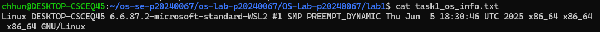
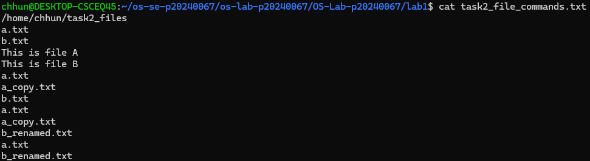
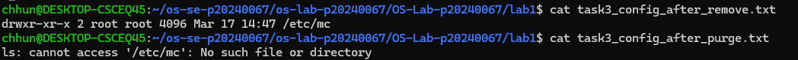
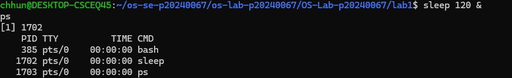
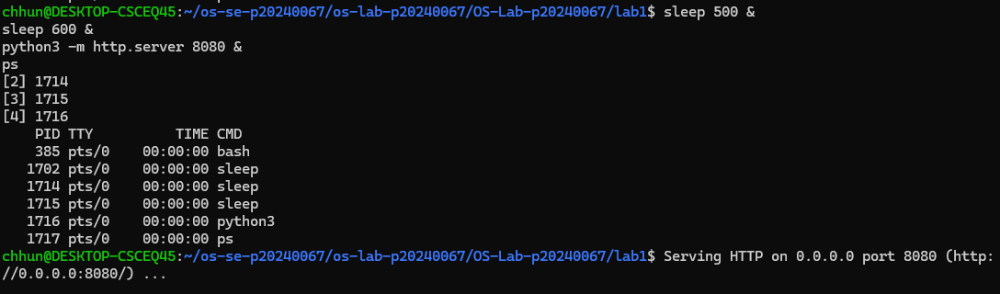
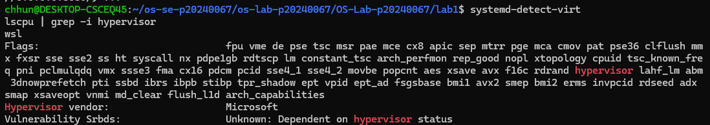

# OS Lab 1 Submission

- **Student Name:** Chum Kimchhun
- **Student ID:** p20240067

---

## Task 1: Operating System Identification

I used Ubuntu (WSL). The system information and kernel version were obtained using `uname -a` and `lsb_release -a`.

---

## Task 2: Essential Linux File and Directory Commands

I practiced creating, copying, renaming, and deleting files using commands like `mkdir`, `touch`, `cp`, `mv`, and `rm`.

---

## Task 3: Package Management Using APT

The `remove` command deletes the program but keeps configuration files.  
The `purge` command deletes both the program and its configuration files.

---

## Task 4: Programs vs Processes

I ran a background process using `sleep 120 &` and confirmed it using `ps`.

---

## Task 5: Multitasking

I ran multiple processes at the same time (sleep commands and a Python web server), showing multitasking.

---

## Task 6: Virtualization

Using `systemd-detect-virt` and `lscpu`, I confirmed the system is running in a virtual environment (WSL).

