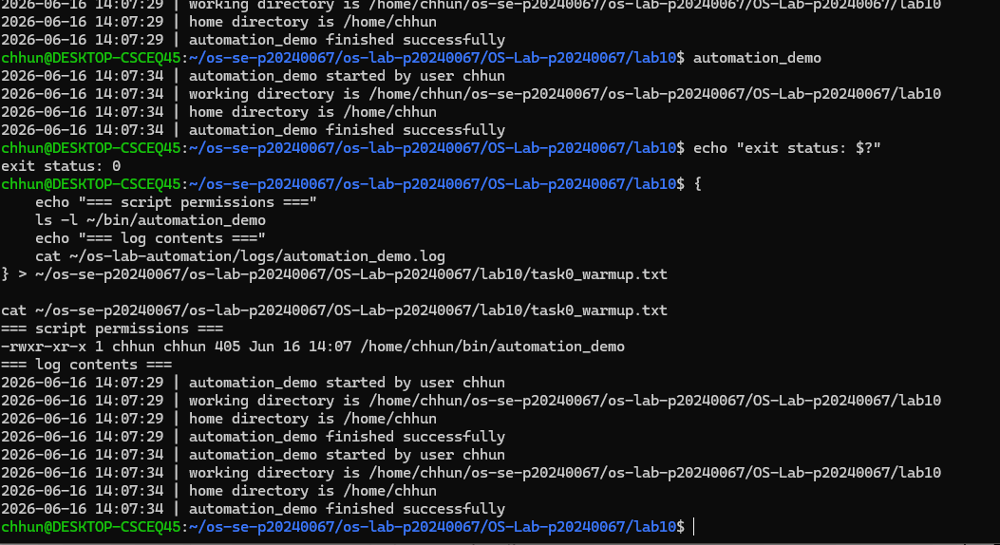
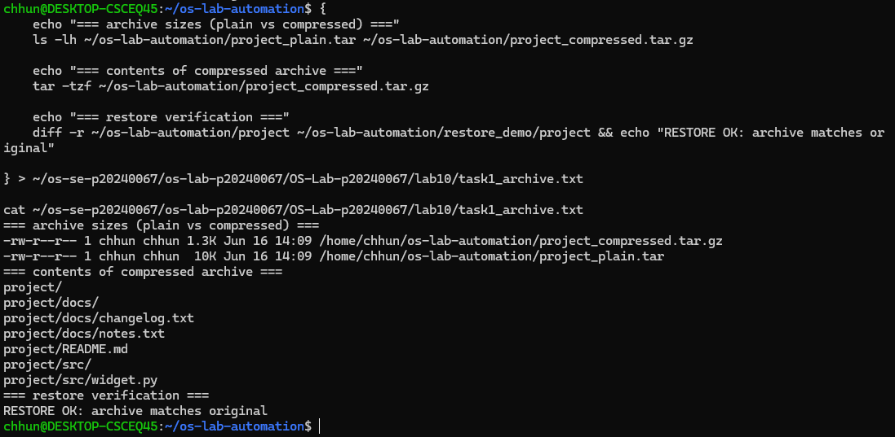
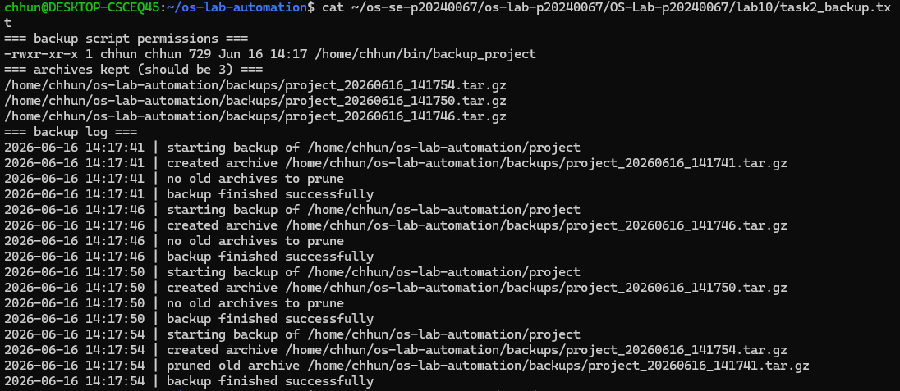
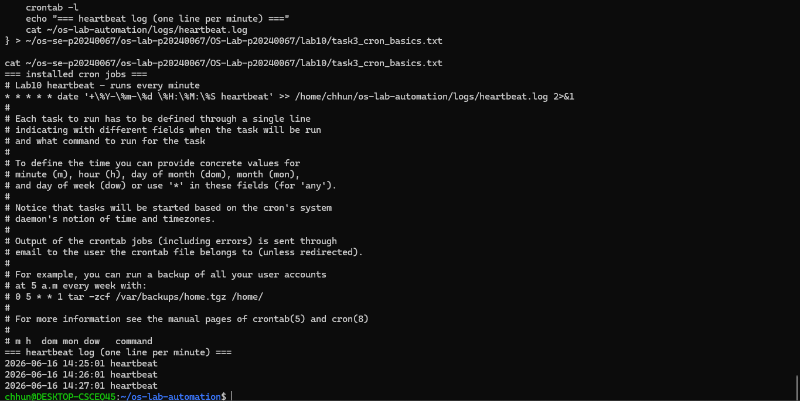
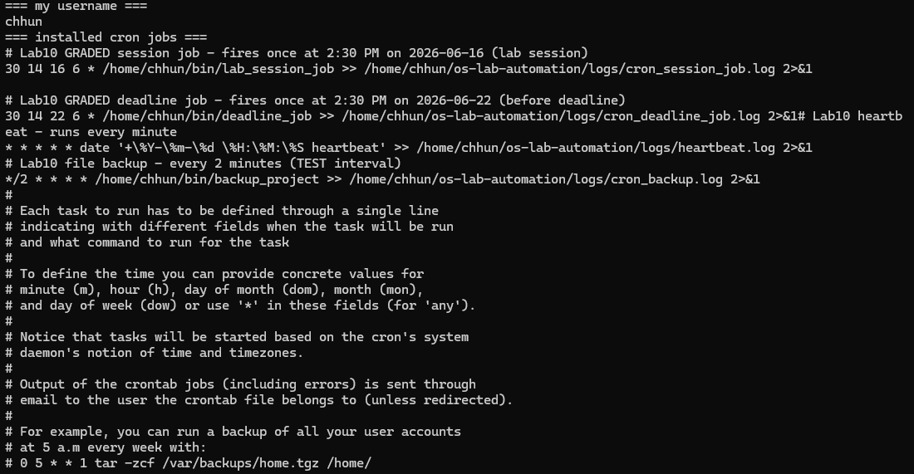

# OS Lab 10 - Backups, Archiving, Scheduling & cron Automation

|                    |            |
| ------------------ | ---------- |
| **Student Name**   | CHHAUN     |
| **Student ID**     | p20240067  |
| **Linux Username** | chhun      |
| **Date**           | 2026-06-16 |

---

## Level 0 - Automation Warm-Up

What I did (1-2 sentences):

I created the `automation_demo` Bash script using functions, timestamped logging, and proper exit codes. I executed the script twice and verified that the log file was appended instead of overwritten.



---

## Level 1 - Archiving & Compression

Size of `.tar` vs `.tar.gz` and why:

The uncompressed archive (`project_plain.tar`) was approximately 10 KB while the compressed archive (`project_compressed.tar.gz`) was approximately 1.3 KB. The `.tar.gz` file is much smaller because gzip compresses repetitive text data very efficiently.



---

## Level 2 - File & Folder Backup Script

How my retention keeps only the 3 newest archives:

The script creates a timestamped backup archive every time it runs. It sorts backups by modification time and automatically deletes older archives, keeping only the three most recent backups.



---

## Level 3 - Cron Fundamentals

My heartbeat cron line and what each field means:

Cron line:

```cron
* * * * * date '+\%Y-\%m-\%d \%H:\%M:\%S heartbeat' >> /home/chhun/os-lab-automation/logs/heartbeat.log 2>&1
```

Field meanings:

* First `*` = every minute
* Second `*` = every hour
* Third `*` = every day of the month
* Fourth `*` = every month
* Fifth `*` = every day of the week

The job appends a timestamped heartbeat message to a log file every minute.



---

## Level 4 - Timed Graded Cron Tasks

The two graded schedules I installed:

| Job          | Schedule       | Fires at           |
| ------------ | -------------- | ------------------ |
| Session job  | `30 14 16 6 *` | 2:30 PM 2026-06-16 |
| Deadline job | `30 14 22 6 *` | 2:30 PM 2026-06-22 |

Session job fired during the lab (`SESSION_JOB_OK` line in `session_job.out`):


Deadline job fired before the deadline (`DEADLINE_JOB_OK` line in `deadline_job.out`):


---

## Level 5 - Scheduling the Backup

Why the job needed the absolute path and output redirect:

Cron runs with a minimal environment and does not reliably know where scripts in `~/bin` are located. Using absolute paths guarantees that cron can find both the script and the log file. Redirecting output with `>> logfile 2>&1` captures both standard output and errors for troubleshooting.



---

## Level 6 - Maintenance Automation

What my maintenance job rotates and reports:

The maintenance script moves log files older than one day into an archive directory and creates a health report. The report includes disk usage, process count, system uptime, and a threshold-based disk usage alert.


---

## Level 7 - Design Your Own Scheduled Job

**What my script does:**

My script monitors available disk space in my home directory and records the free space with a timestamp in a log file.

**Schedule I chose (and why):**

```cron
*/2 * * * * /home/chhun/bin/my_automation >> /home/chhun/os-lab-automation/logs/cron_my_automation.log 2>&1
```

I chose every two minutes so that I could quickly verify that cron executed the job during the lab session.

**What each of the five cron fields means in my line:**

* `*/2` = every 2 minutes
* `*` = every hour
* `*` = every day of the month
* `*` = every month
* `*` = every day of the week


---

## Level 8 - Teardown and Reset

How I removed the practice jobs while keeping the graded deadline job:

I used a filtered `crontab` command to preserve only the two graded jobs while removing the heartbeat, backup, maintenance, and custom automation jobs. This prevented unnecessary logging while ensuring the graded deadline job remained installed.


---

## Lab Questions

### 1. Archiving (`tar`) vs compression (`gzip`) - which shrinks bytes?

Archiving combines multiple files and folders into a single file, while compression reduces file size by removing redundancy in the data. `gzip` is the component that actually shrinks bytes.

### 2. How much smaller was your `.tar.gz` than your `.tar`, and why?

My `.tar` file was approximately 10 KB and my `.tar.gz` file was approximately 1.3 KB. The compressed archive was much smaller because the project contained text files with repetitive content that compresses efficiently.

### 3. Why did your cron jobs need an absolute path instead of `~/bin/...`?

Cron runs with a limited environment and does not automatically know the user's shell PATH configuration. Absolute paths ensure the script and log locations can always be found.

### 4. Why must `%` be escaped as `\%` in a crontab, and what does `>> logfile 2>&1` do?

In cron, `%` has a special meaning and is interpreted as a newline. Escaping it with `\%` prevents that behavior. `>> logfile 2>&1` appends both standard output and standard error to the same log file.

### 5. How does your `backup_project` retention decide what to delete, and why keep only N backups?

The script sorts backup archives by modification time and keeps only the newest three. Older archives are deleted automatically. Limiting the number of backups prevents unnecessary disk usage.

### 6. Write the cron line that runs `/home/me/bin/deadline_job` once at 2:30 PM on 22 June. Which fields are filled in, which stay `*`?

```cron
30 14 22 6 * /home/me/bin/deadline_job
```

Filled fields:

* Minute = 30
* Hour = 14
* Day of Month = 22
* Month = 6

Wildcard field:

* Day of Week = `*`

### 7. In Level 8 teardown, why a filtered `crontab -` pipeline instead of `crontab -r`? What would `crontab -r` have broken?

A filtered pipeline removes only selected jobs while preserving required jobs. Using `crontab -r` would delete the entire crontab, including the graded deadline job that still needed to run.

### 8. Why is a scheduled health check with a threshold alert useful in real software engineering / operations?

It provides continuous monitoring of system health and can warn administrators before resources such as disk space become critical. Early detection helps prevent outages and service disruptions.

### 9. Describe the job you wrote in Level 7: what it does, the schedule, and the meaning of each of its five cron fields.

My custom job records available disk space in my home directory and writes the information to a log file with a timestamp. The schedule is:

```cron
*/2 * * * * /home/chhun/bin/my_automation >> /home/chhun/os-lab-automation/logs/cron_my_automation.log 2>&1
```

Field meanings:

* `*/2` = every 2 minutes
* First `*` = every hour
* Second `*` = every day of the month
* Third `*` = every month
* Fourth `*` = every day of the week

This schedule allowed me to observe multiple successful executions during the lab.
