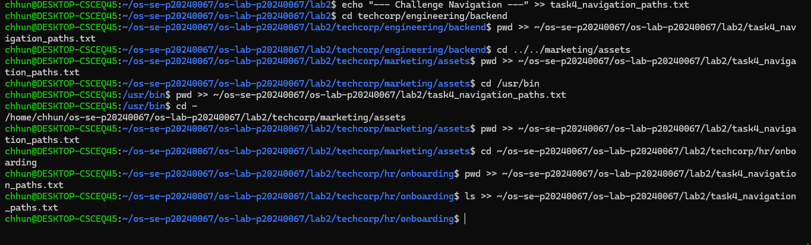
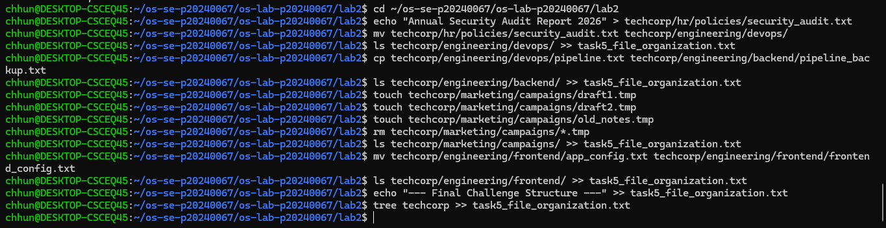
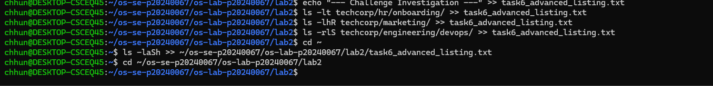
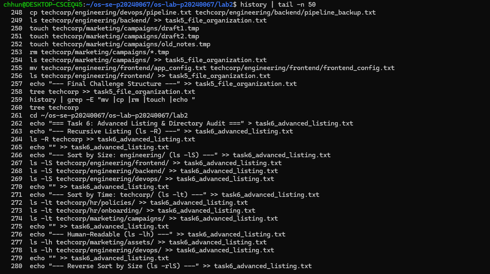

# OS Lab 2 Submission

- **Student Name:** Chum Kimchhun
- **Student ID:** p20240067
## Task Output Files

During the lab, each task redirected its output into .txt files. These files are your primary proof of work.

Make sure all of the following files are present in your lab2/ folder:

- task1_basic_navigation.txt
- task2_filesystem_exploration.txt
- task3_directory_structure.txt
- task4_navigation_paths.txt
- task5_file_organization.txt
- task6_advanced_listing.txt
## Screenshots

The screenshots below focus on the Challenge sections and command history.

---

### Screenshot 1 — Task 4 Challenge Commands

---

### Screenshot 2 — Task 4 Challenge History

---

### Screenshot 3 — Task 5 Challenge Commands

---

### Screenshot 4 — Task 5 Challenge History

---

### Screenshot 5 — Task 6 Challenge Commands

---

### Screenshot 6 — Task 6 Challenge History

---

### Screenshot 7 — Full Command History

