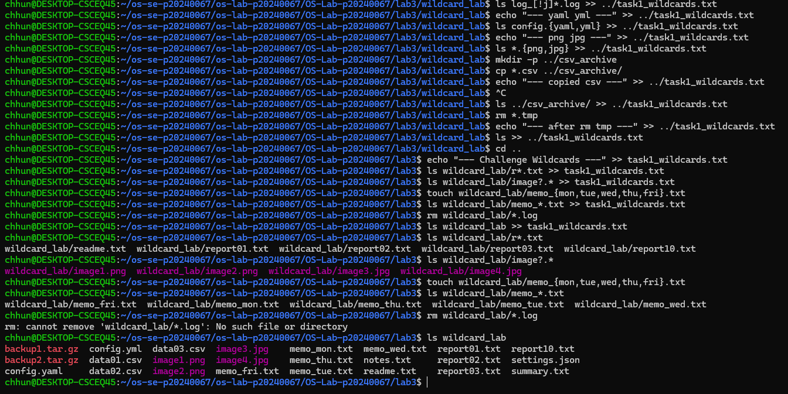
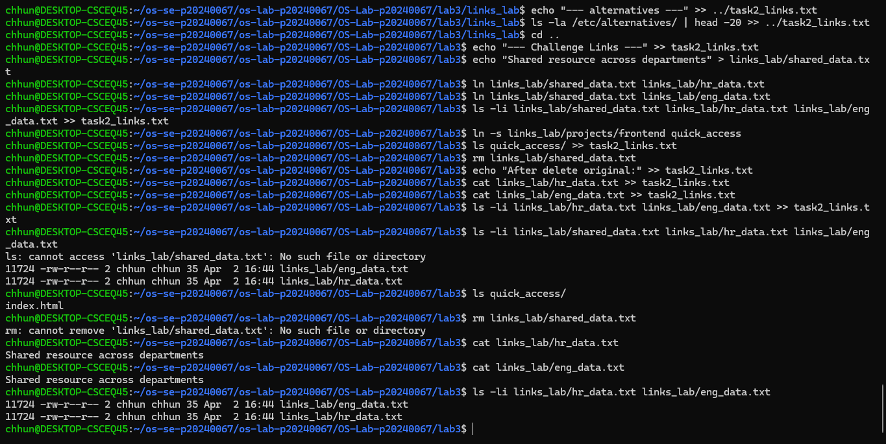
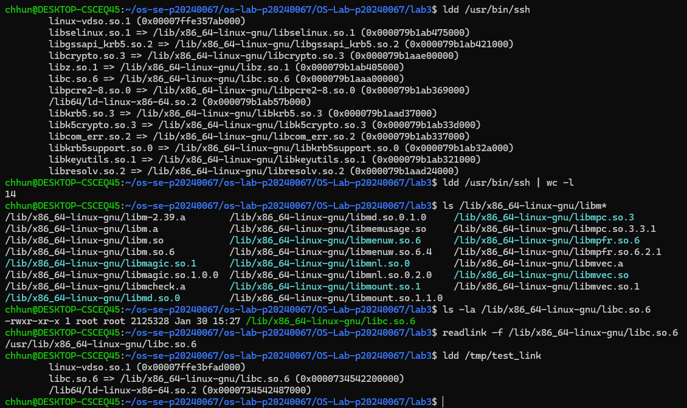
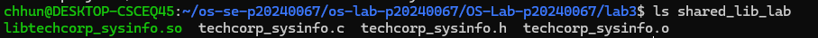

# OS Lab 3 Submission — Wildcards, Links, GRUB & Shared Libraries

- **Student Name:** Chhun Kimchhun
- **Student ID:** P20240067
- **Partner Name (Task 5):** Phada
- **Partner ID (Task 5):** P20240058

---

## Task Output Files

During the lab, each task redirected its output into `.txt` files. These files are your primary proof of work for the **guided portions of each task**. Make sure all of the following files are present in your `lab3/` folder:

- [x] `task1_wildcards.txt`
- [x] `task2_links.txt`
- [ ] `task3_grub.txt` (VM task skipped/not attempted)
- [x] `task4_shared_objects.txt`
- [x] `task5_shared_library.txt`
- [x] `task_history.txt`

---

## Notes on Task 3 (VM Section)
Task 3 (GRUB & VM recovery tasks) was not completed as it is VM-based and not required for this submission setup.

---

## Screenshots

The screenshots below document the **Challenge sections**, **pair task**, and **command history**. The guided task outputs are already captured in the `.txt` files above.

---

### Screenshot 1 — Task 1 Challenge: Wildcards


---

### Screenshot 2 — Task 2 Challenge: Links


---

### Screenshot 12 — Task 4 Challenge: Shared Objects


---

### Screenshot 13 — Task 5: Pair API Design


---

### Screenshot 14 — Task 5: Pair Integration Test


---

### Screenshot 15 — Full Command History

```bash
history | tail -n 100
