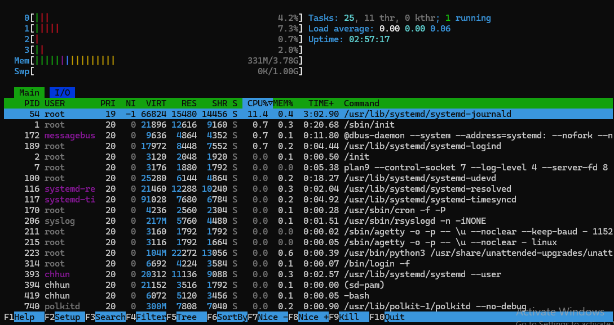
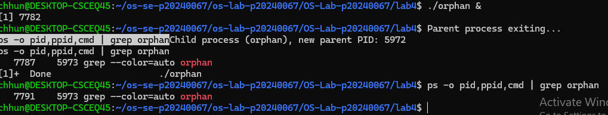
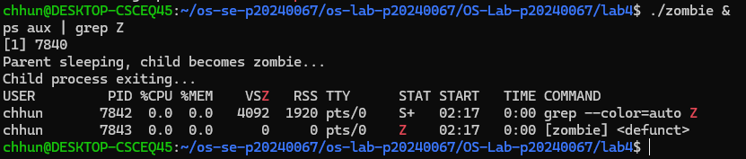
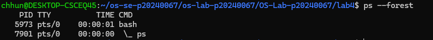
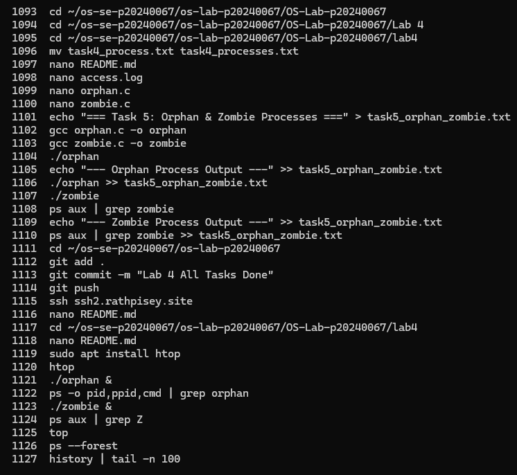

# OS Lab 4 Submission — I/O Redirection, Pipelines & Process Management

- **Student Name:** Chum Kimchhun
- **Student ID:** p20240067

---

## Task Output Files

During the lab, each task redirected its output into `.txt` files. These files are your primary proof of work for the **guided portions** of each task. Make sure all of the following files are present in your `lab4/` folder:

- [x] `task1_redirection.txt`
- [x] `task2_pipelines.txt`
- [x] `task3_analysis.txt`
- [x] `task4_processes.txt`
- [x] `task5_orphan_zombie.txt`
- [x] `orphan.c`
- [x] `zombie.c`
- [x] `access.log`

---

## Screenshots

The screenshots below document the **interactive tools**, **process observations**, **challenge sections**, and **command history**.

---

### Screenshot 1 — Task 4: `top` Output

---

### Screenshot 2 — Task 4: `htop` Tree View

---

### Screenshot 3 — Task 5: Orphan Process

---

### Screenshot 4 — Task 5: Zombie Process

---

### Screenshot 5 — Task 4 Challenge: Highest Memory Process

---

### Screenshot 6 — Task 5 Challenge: Process Tree with 3 Children

---

### Screenshot 7 — Command History

---

## Answers to Task 5 Questions

1. **How are orphans cleaned up?**
   > Orphan processes are automatically adopted by the init process (PID 1, usually systemd). The init process becomes their new parent and manages them.

2. **How are zombies cleaned up?**
   > Zombie processes are cleaned up when the parent process calls wait() or waitpid() to read the child's exit status. This removes the zombie from the process table.

3. **Can you kill a zombie with `kill -9`? Why or why not?**
   > No, you cannot kill a zombie process using kill -9 because it is already terminated. It only remains as an entry in the process table until the parent collects its exit status.

---

## Reflection

> The most useful techniques I learned were I/O redirection and pipelines. These allow combining multiple commands efficiently. In a real server environment, pipelines can be used to filter logs, monitor system performance, and automate tasks such as extracting errors from log files.
