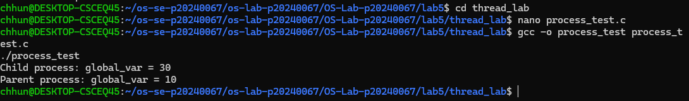
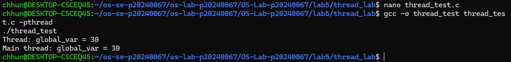
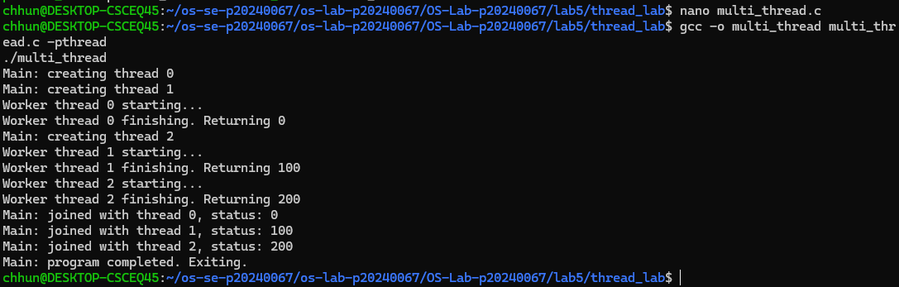
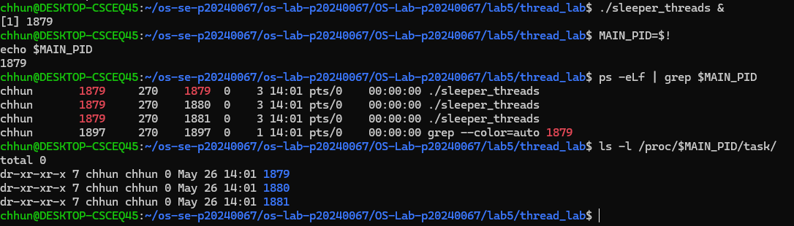
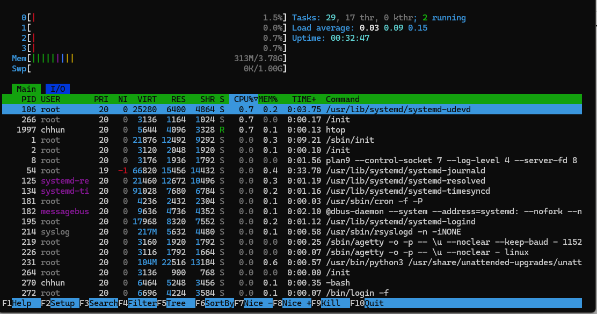
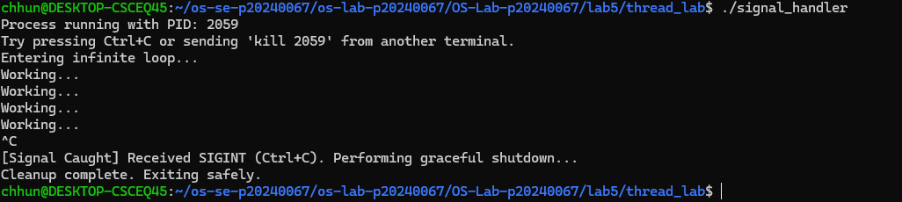
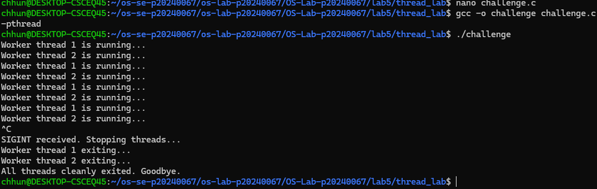

# OS Lab 5 Submission — Threads, Kernel Workers & Process Signals

- **Student Name:** Chumkimchhun
- **Student ID:** p20240067

---

## Task Output Source Files

Make sure all of the following files are present in your `lab5/thread_lab/` folder:

- [x] `process_test.c`
- [x] `thread_test.c`
- [x] `multi_thread.c`
- [x] `sleeper_threads.c`
- [x] `signal_handler.c`
- [x] `challenge.c`

---

## Screenshots

### Screenshot 1 — Task 1: Process vs Thread (Process Test)

---

### Screenshot 2 — Task 1: Process vs Thread (Thread Test)

---

### Screenshot 3 — Task 2: Thread Interaction

---

### Screenshot 4 — Task 3: Visualizing 1:1 Thread Mapping

---

### Screenshot 5 — Task 3: `htop` Kernel Threads

---

### Screenshot 6 — Task 4: Catching `SIGINT`

---

### Screenshot 7 — Challenge: Graceful Multithreaded Shutdown

---

## Answers to Lab Questions

1. **Why do threads share memory while processes do not (by default)?**

   > Threads belong to the same process, so they share the same memory space and resources. Processes are separate programs with independent memory spaces for protection and isolation.

2. **Based on the 1:1 mapping, what is the role of an LWP (Lightweight Process) in Linux?**

   > An LWP represents a kernel-level thread that the Linux kernel schedules independently. Each user thread maps directly to one LWP.

3. **Why is it restricted to send signals to kernel threads (e.g., `kthreadd` or `kworker`)?**

   > Kernel threads are essential for system operations and stability. Allowing users to freely stop or kill them could crash or damage the operating system.

4. **Why can't `SIGKILL` (kill -9) be caught by a signal handler?**

   > SIGKILL is designed to immediately terminate a process without allowing cleanup or handling, ensuring the operating system can always stop problematic processes.

---

## Reflection

> The most challenging part was understanding how threads map to kernel threads and how signals interact with multithreaded programs. This lab showed how threads improve performance by running tasks concurrently and how signals can safely control or stop programs. These concepts are important in large-scale systems like web servers and databases where many tasks and clients run simultaneously.
