# OS Lab 6 Submission — Linux Security, Users, Groups & File Permissions

- **Student Name:** Chumkimchhun
- **Student ID:** p20240067

---

## Task Output Files

Make sure all of the following files are present in your `lab6/` folder:

- [x] `task1_users.txt`
- [x] `task2_groups.txt`
- [x] `task3_permissions.txt`
- [x] `task3_stat_output.txt`
- [x] `task4_special_bits.txt`
- [x] `task5_acl.txt`
- [x] `security_lab/whoami_suid.c`

---

## Screenshots

Insert your screenshots below.

### Screenshot 1 — Task 1: User Creation
Show `cat task1_users.txt` confirming both `dev_alice` and `dev_bob` accounts exist.

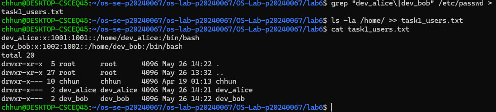

---

### Screenshot 2 — Task 1: User Modification
Show the updated `/etc/passwd` entry for `dev_alice` with the GECOS comment field.

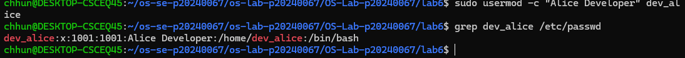

---

### Screenshot 3 — Task 2: Group Setup
Show `cat task2_groups.txt` with group membership for both users.

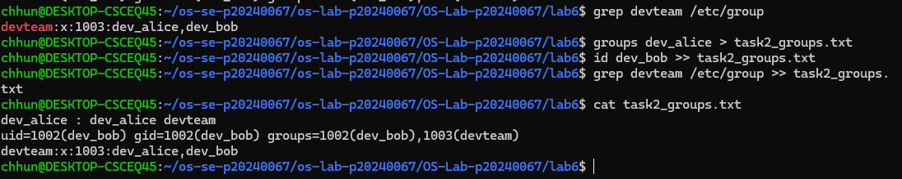

---

### Screenshot 4 — Task 2: Multiple Group Membership
Show `id dev_alice` confirming membership in both `devteam` and `auditors`.

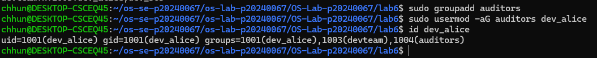

---

### Screenshot 5 — Task 3: Directory Permissions
Show `cat task3_permissions.txt` with `drwxrwx---` on the project directory.

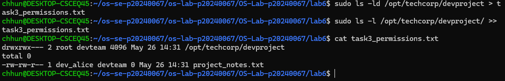

---

### Screenshot 6 — Task 3: Access Denied
Show the `Permission denied` error when `temp_user` tries to access the project directory.

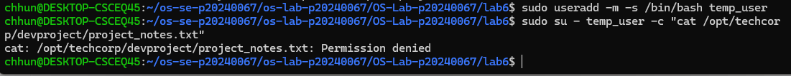

---

### Screenshot 7 — Task 4: setgid Bit
Show the directory listing with `s` in the group execute position, and `bob_file.txt` inheriting the `devteam` group.

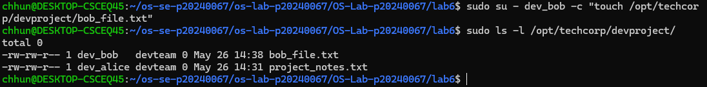

---

### Screenshot 8 — Task 4: Sticky Bit
Show the `t` bit in the directory listing and the `Operation not permitted` error when `dev_bob` tries to delete `dev_alice`'s file.

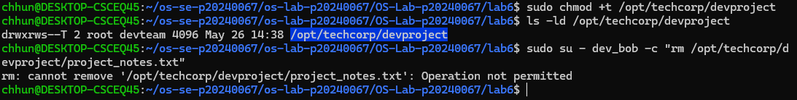

---

### Screenshot 9 — Task 4: setuid Bit
Show `ls -l whoami_suid` with `s` in the owner execute position and the program's UID output.

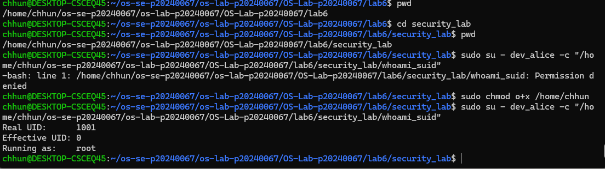

---

### Screenshot 10 — Task 5: ACL Directory
Show `getfacl /opt/techcorp/devproject` with the `auditors` ACE.

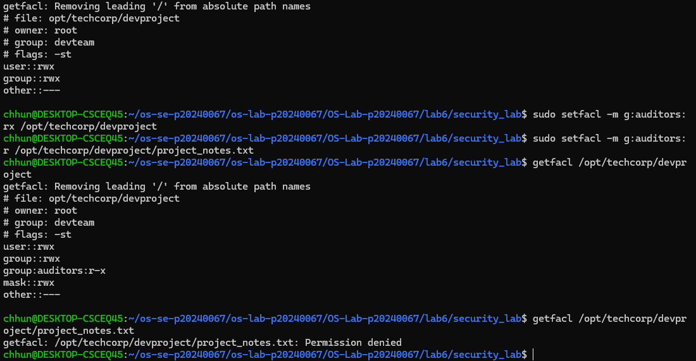

---

### Screenshot 11 — Task 5: ACL Access Test
Show `dev_alice` successfully accessing the file and `temp_user` being denied.

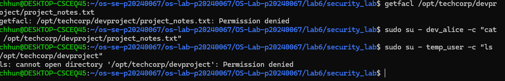

---

### Screenshot 12 — Task 5: ACL Output File
Show `cat task5_acl.txt` with the full ACL entries.

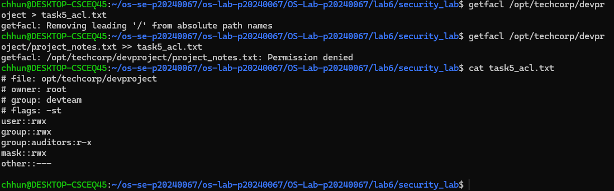

---

## Answers to Lab Questions

### 1. What is the difference between `userdel` and `userdel -r`?

`userdel` removes only the user account from the system, while `userdel -r` removes both the user account and the user’s home directory along with related files.

---

### 2. Why is it safer to use `visudo` instead of directly editing `/etc/sudoers`?

`visudo` checks the syntax before saving the file and prevents multiple users from editing the sudoers file at the same time. This helps avoid configuration mistakes that could break sudo access.

---

### 3. What happens when a `setgid` directory contains files created by different users? What benefit does this provide for team collaboration?

Files created inside a `setgid` directory automatically inherit the group ownership of the directory instead of the creator’s default group. This makes collaboration easier because all team members can share and access files within the same project group.

---

### 4. What limitation of standard Unix permissions does the ACL system solve?

Standard Unix permissions only support permissions for owner, group, and others. ACLs solve this limitation by allowing specific permissions for multiple individual users and groups without changing ownership.

---

## Reflection

The most challenging part of this lab was understanding how special permission bits and ACLs interact with normal Linux file permissions. I learned how Linux controls access through users, groups, ownership, and advanced permission systems. These concepts are important in large-scale applications like web servers and databases because multiple users and services require secure and organized shared access to files and directories.
