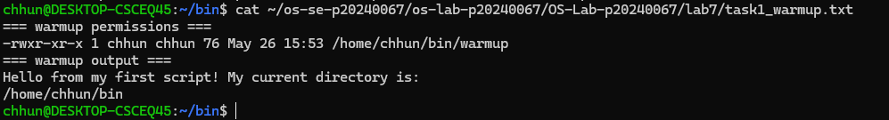
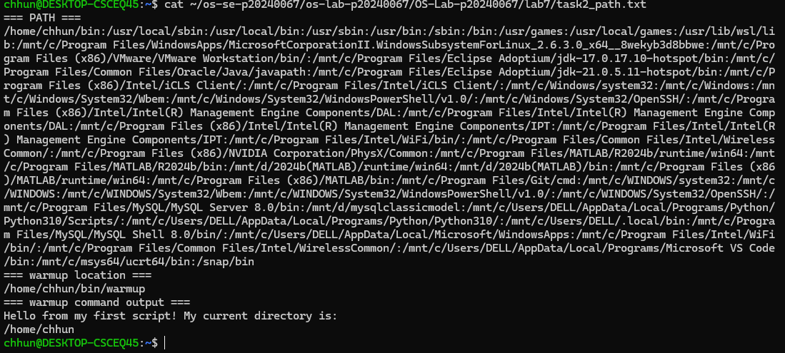
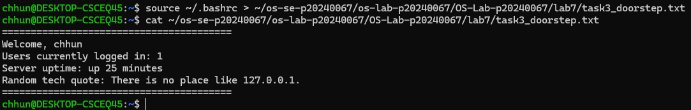
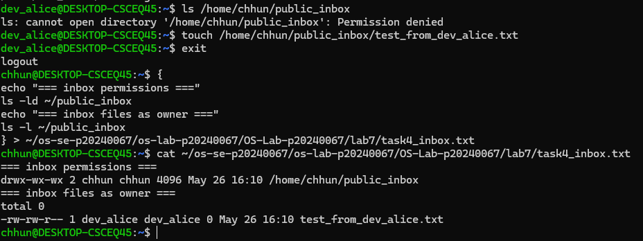
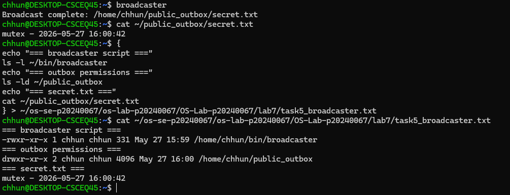
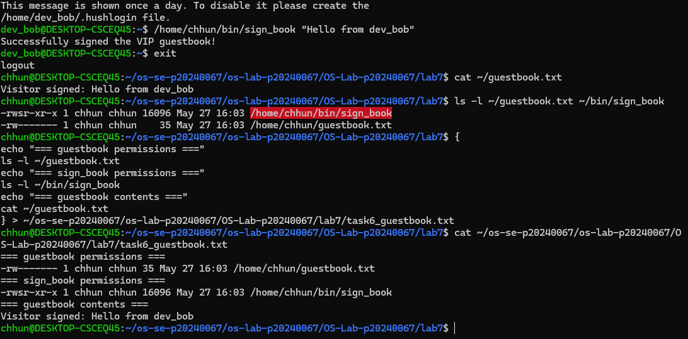
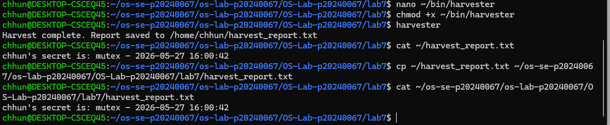
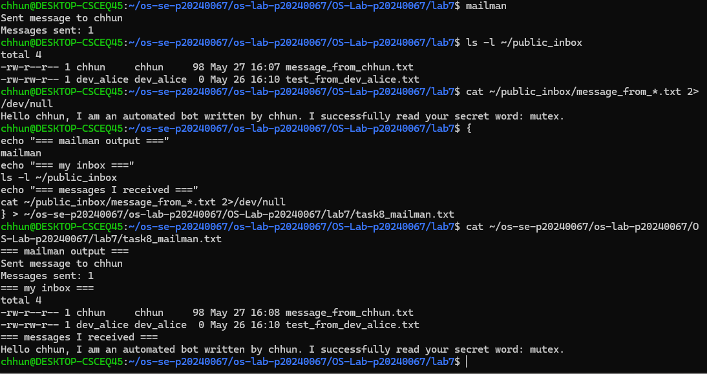

# OS Lab 7 Submission — Bash Scripting, Permissions & Server Automation

- **Student Name:** Chumkimchhun
- **Student ID:** P20240067

---

## Task Output Source Files

Make sure all required files are present in your `lab7/` folder.

- [x] `task1_warmup.txt`
- [x] `task2_path.txt`
- [x] `task3_doorstep.txt`
- [x] `task4_inbox.txt`
- [x] `task5_broadcaster.txt`
- [x] `task6_guestbook.txt`
- [x] `harvest_report.txt`
- [x] `task8_mailman.txt`
- [x] `sign_book.c`

---

# Screenshots

## Screenshot 1 — Task 1: Warm-Up Script
Shows executable permissions and successful execution of `warmup`.

---

## Screenshot 2 — Task 2: PATH Configuration
Shows PATH variable, `which warmup`, and execution without `./`.

---

## Screenshot 3 — Task 3: Doorstep Login Message
Shows customized `.bashrc` welcome message with uptime and quote.

---

## Screenshot 4 — Task 4: Secure Mailbox
Shows `public_inbox` permissions and test file from another user.

---

## Screenshot 5 — Task 5: Broadcaster
Shows generated `secret.txt` inside `public_outbox`.

---

## Screenshot 6 — Task 6: VIP Guestbook
Shows SUID permissions and guestbook contents.

---

## Screenshot 7 — Task 7: Harvester
Shows `harvest_report.txt` collecting readable secrets.

---

## Screenshot 8 — Task 8: Mailman Bot
Shows automated message delivery and inbox contents.

---

# Scripts Included

The following scripts/binaries are included in `lab7/scripts/`:

- `warmup`
- `broadcaster`
- `harvester`
- `mailman`
- `sign_book_binary`

---

# Answers to Lab Questions

### 1. Why did `warmup` fail before you added execute permission?

The script failed because Linux requires the executable permission bit to be enabled before a file can run as a program. Without execute permission, the shell returns “Permission denied”.

---

### 2. What does adding `~/bin` to `PATH` allow you to do?

Adding `~/bin` to `PATH` allows scripts stored in that directory to run like normal commands without typing `./` or the full path.

---

### 3. Why does `chmod 733 public_inbox` allow classmates to drop files but not list the inbox?

Permission `733` gives the owner full access while others only get write and execute permissions. Execute allows entering the directory, and write allows creating files, but without read permission users cannot list directory contents.

---

### 4. Why does Linux ignore SUID on shell scripts, and why did we use a compiled C program instead?

Linux ignores SUID on shell scripts because it creates security risks such as race-condition exploits. A compiled C program is safer and allows controlled privilege execution using the SUID bit.

---

### 5. What is the difference between `>` and `>>` in Bash redirection?

`>` overwrites a file with new content, while `>>` appends new content to the end of an existing file.

---

### 6. How did your `harvester` avoid reading files that were missing or not readable?

The script used conditional checks with `[ -f "$target_file" ]` and `[ -r "$target_file" ]` to verify that the file existed and was readable before attempting to read it.

---

### 7. What permission problems did you or your classmates need to fix during the lab?

Some permission problems included missing execute permission on scripts, inaccessible home directories, incorrect inbox permissions, and unreadable public outbox files. These were fixed using `chmod` and proper directory permissions.

---

# Reflection

This lab helped me understand how Bash scripting, Linux permissions, and automation work together in a real Linux environment. The most challenging part was configuring permissions correctly for inboxes and SUID behavior while still keeping files secure. I also learned how automation scripts can interact across user directories safely. These concepts are important for real systems such as servers, DevOps automation, and multi-user Linux environments.
