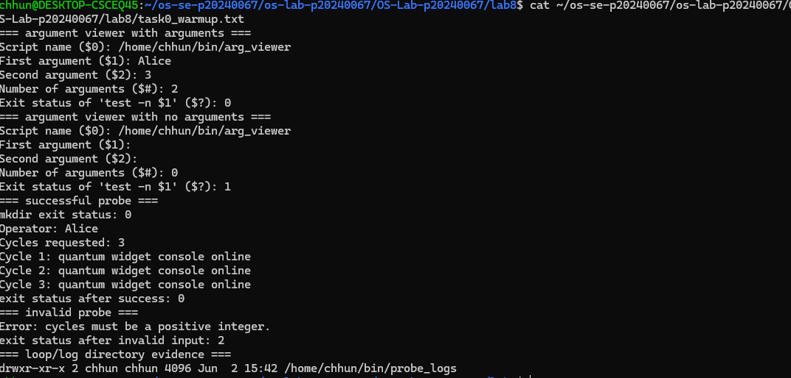
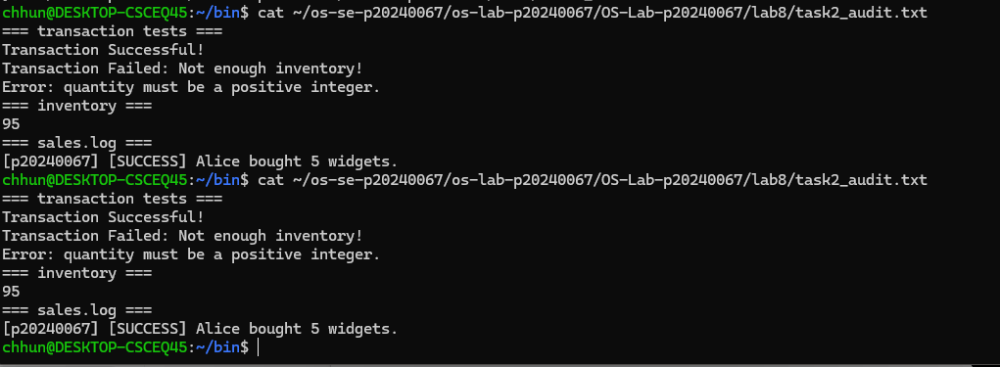
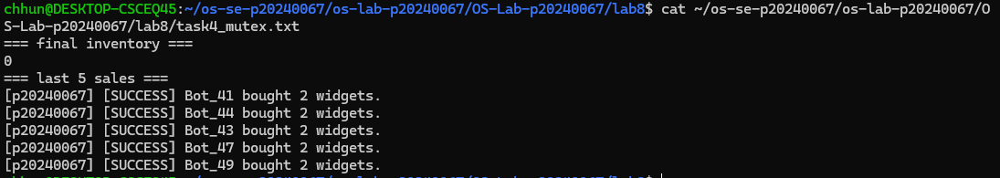
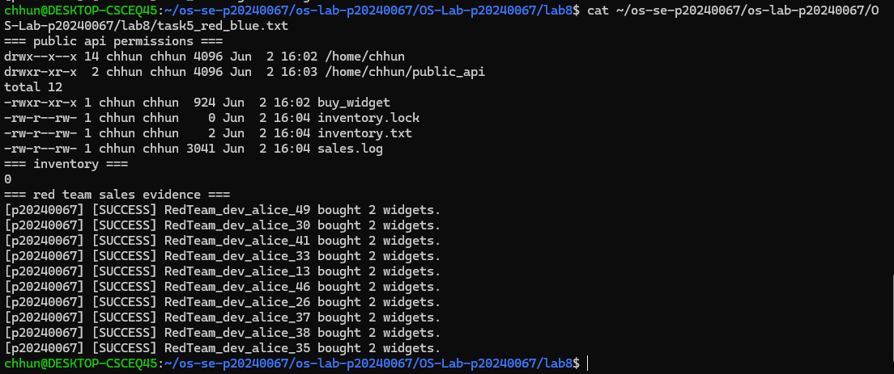
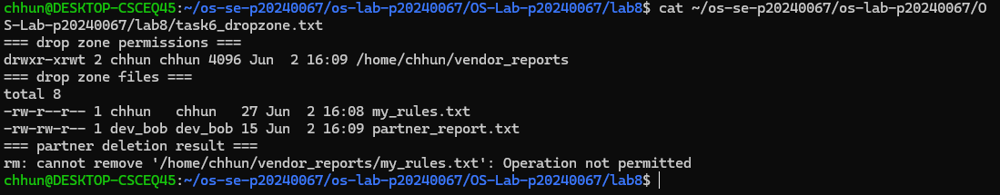
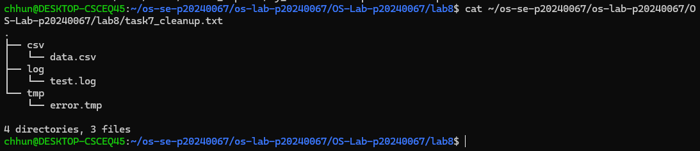

# OS Lab 8 Submission - The Quantum Widget Exploit

**Student Name:** Chum Kimchhun
**Student ID:** p20240067
**Partner Username:** dev_alice

---

# Task Output Files

The following files are included in the lab8 folder:

* observations.txt
* task0_warmup.txt
* task1_validation.txt
* task2_audit.txt
* task4_mutex.txt
* task5_red_blue.txt
* task6_dropzone.txt
* task7_cleanup.txt

Scripts:

* scripts/arg_viewer
* scripts/quantum_probe
* scripts/buy_widget
* scripts/bot_swarm
* scripts/create_dropzone
* scripts/cleanup

---

# Screenshots

## Screenshot 1 - Level 0: Bash Warm-Up Scripts

Shows arg_viewer demonstrating $0, $1, $2, $#, and $? along with quantum_probe using conditionals and loops.

---

## Screenshot 2 - Level 2: Audit Trails

Shows successful and failed transactions, inventory updates, and sales logging.

---

## Screenshot 3 - Level 4: Mutex Patch

Shows inventory reaching exactly 0 after the patched bot_swarm execution and displays the last five log entries.

---

## Screenshot 4 - Level 5: Red Team vs. Blue Team

Shows public_api permissions, inventory protection, and evidence of partner execution.

---

## Screenshot 5 - Level 6: Secure Drop Zone

Shows sticky-bit permissions and proof that another user could not delete the owner's file.

---

## Screenshot 6 - Level 7: Forensic Cleanup

Shows files sorted into extension-based directories.

---

# Race Condition Observations

| Run | Final Inventory | Notes             |
| --- | --------------- | ----------------- |
| 1   | 66              | Suspicious result |
| 2   | 70              | Suspicious result |
| 3   | 62              | Suspicious result |
| 4   | 78              | Suspicious result |
| 5   | 60              | Suspicious result |

### Explanation

The vulnerable buy_widget script suffered from a Time-of-Check to Time-of-Use (TOC-TOU) race condition. Multiple bot processes read the same inventory value before other processes finished updating it. Because the inventory read, calculation, and write operations were not protected by mutual exclusion, concurrent processes overwrote each other's updates. The exact result depended on how the operating system scheduler interleaved process execution.

---

# Answers to Lab Questions

## In arg_viewer, what did $0, $1, $2, $#, and $? mean when you ran the script?

$0 represented the script name and path. $1 was the first command-line argument, $2 was the second command-line argument, $# represented the number of arguments supplied, and $? represented the exit status of the most recently executed command. A value of 0 indicated success, while a nonzero value indicated failure.

---

## What does TOC-TOU mean, and where did it appear in the vulnerable buy_widget script?

TOC-TOU stands for Time-of-Check to Time-of-Use. It occurs when a program checks a resource and later uses it, allowing another process to modify the resource in between. In the vulnerable buy_widget script, the inventory was read and checked before being updated, allowing concurrent processes to interfere with each other.

---

## Why did bot_swarm sometimes leave inventory values other than 0 before the patch?

The bot_swarm script launched 50 concurrent purchase requests. Multiple processes read the same inventory value simultaneously and overwrote each other's updates. This race condition caused lost updates, leaving inventory values greater than zero.

---

## What part of the script is the critical section, and why must it be protected?

The critical section includes reading the inventory, checking availability, calculating the new inventory value, writing the updated inventory, and recording the transaction in the log. It must be protected because multiple processes accessing the shared inventory simultaneously can corrupt the data.

---

## How does flock -x enforce mutual exclusion between concurrent processes?

flock -x acquires an exclusive lock on a file descriptor. While one process holds the lock, all other processes attempting to acquire the same lock must wait. This guarantees that only one process can execute the critical section at a time.

---

## Which permissions did you use to let a classmate run your API without giving full access to your home directory?

I used chmod o+x on my home directory to allow traversal without revealing directory contents. The public_api directory was set to 755, the buy_widget script was given read and execute permissions, and the inventory and log files were given read and write permissions as required.

---

## Why does the sticky bit protect files in a shared drop zone?

The sticky bit allows users to create files in a shared directory but prevents them from deleting or renaming files owned by other users. Only the file owner, directory owner, or root user can remove the file.

---

## What defensive scripting practice from this lab would you use in a real production script?

I would use strict input validation and file locking. Input validation prevents invalid or malicious data from entering the system, while file locking prevents race conditions and protects shared resources from concurrent modification.

---

# Reflection

This lab demonstrated how Bash scripts interact with operating system concepts such as process scheduling, file permissions, and concurrent resource access. The race-condition experiment showed that multiple processes can produce inconsistent results when shared data is not protected. Using flock provided a practical example of mutual exclusion and critical-section protection. The permission exercises reinforced the principle of least privilege by allowing controlled access to resources without exposing an entire account. Overall, the lab showed how secure scripting requires both correct program logic and proper operating system controls.
