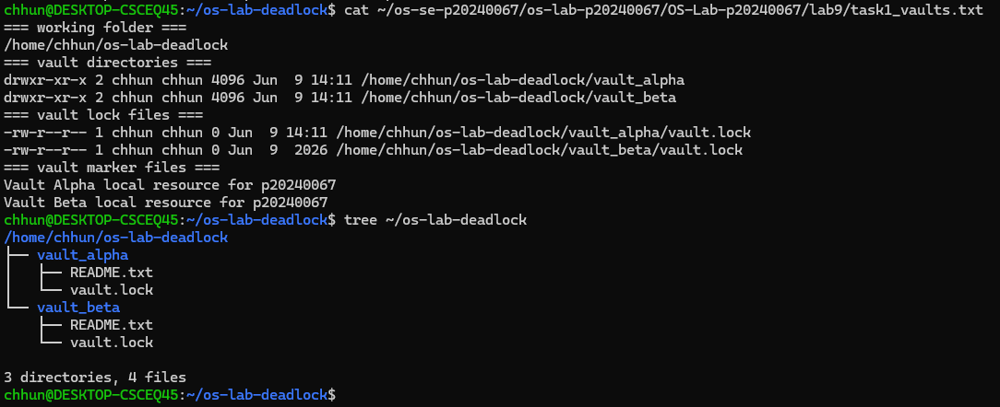
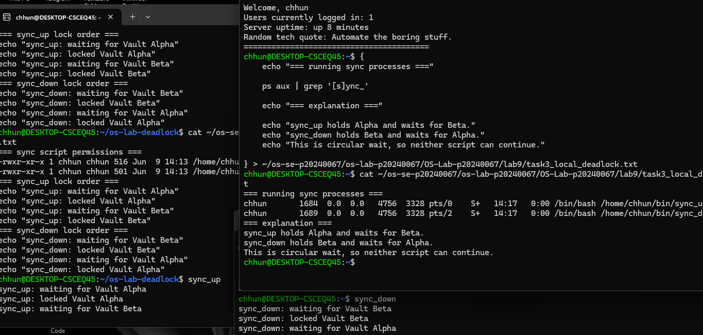
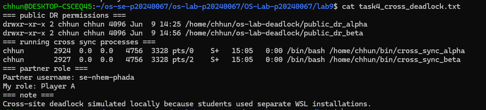
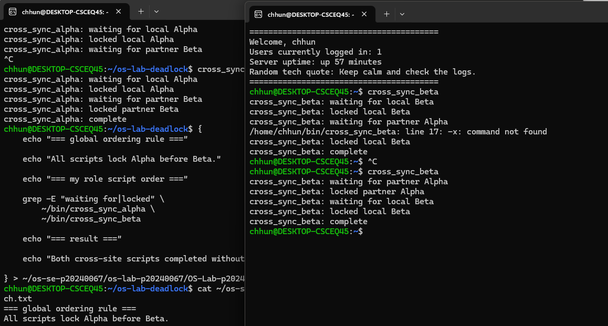
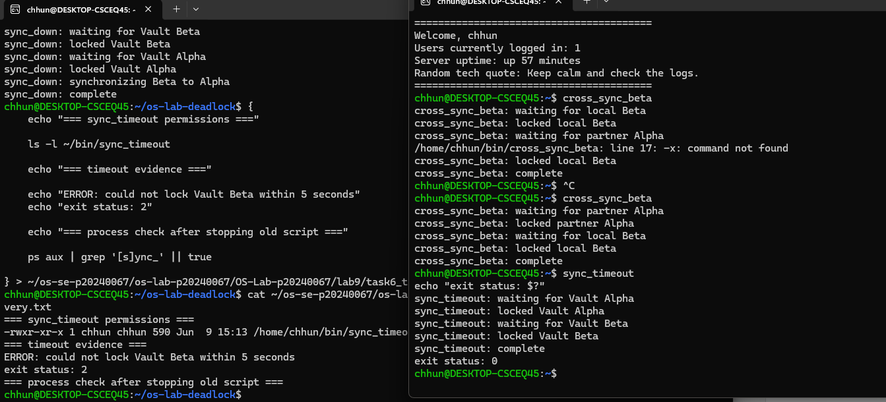
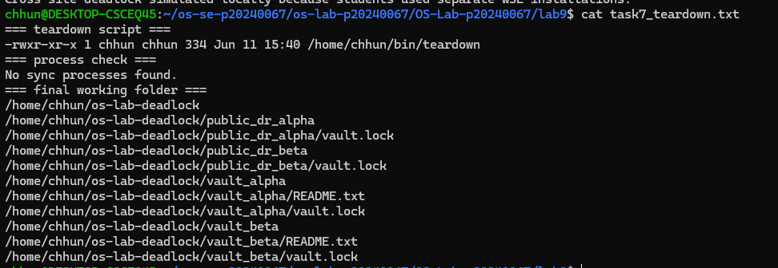

# OS Lab 9 Submission - The Quantum Vault Deadlock

* **Student Name:** CHUM KIMCHHUN
* **Student ID:** p20240067
* **Linux Username:** se-chum-kimchhun
* **Partner Username:** se-nhem-phada
* **My Role:** Player A

---

## Required Working Files Outside the Repo

Confirm these files and folders existed while you ran the lab:

* [x] `~/bin/sync_up`
* [x] `~/bin/sync_down`
* [x] `~/bin/sync_timeout`
* [x] `~/bin/teardown`
* [x] `~/bin/cross_sync_alpha`
* [x] `~/os-lab-deadlock/README.md`
* [x] `~/os-lab-deadlock/vault_alpha/README.txt`
* [x] `~/os-lab-deadlock/vault_alpha/vault.lock`
* [x] `~/os-lab-deadlock/vault_beta/README.txt`
* [x] `~/os-lab-deadlock/vault_beta/vault.lock`
* [x] `~/os-lab-deadlock/public_dr_alpha/vault.lock`

---

## Task Output Files

The following files were generated during the lab:

* [x] `task1_vaults.txt`
* [x] `task2_sync_scripts.txt`
* [x] `task3_local_deadlock.txt`
* [x] `task4_cross_deadlock.txt`
* [x] `task5_ordering_patch.txt`
* [x] `task6_timeout_recovery.txt`
* [x] `task7_teardown.txt`
* [x] `scripts/sync_up`
* [x] `scripts/sync_down`
* [x] `scripts/sync_timeout`
* [x] `scripts/teardown`
* [x] `scripts/cross_sync_alpha`
* [x] `scripts/cross_sync_beta`

---

## Screenshots

### Screenshot 1 - Level 1: Vault Workspace Setup

The screenshot shows the creation of `vault_alpha`, `vault_beta`, and their associated lock files.

---

### Screenshot 2 - Level 3: Local Deadlock

The screenshot demonstrates a deadlock between `sync_up` and `sync_down`, where each script holds one vault lock and waits for the other.

---

### Screenshot 3 - Level 4: Site-to-Site Deadlock

Cross-site deadlock was simulated locally because students used separate WSL installations and could not directly access each other's Linux home directories.

---

### Screenshot 4 - Level 5: Global Resource Ordering Patch

The screenshot shows successful completion after enforcing the Alpha-before-Beta lock ordering rule.

---

### Screenshot 5 - Level 6: Timeout Recovery

The screenshot shows timeout-based recovery using `flock -w`, preventing indefinite waiting.

---

### Screenshot 6 - Level 7: Cleanup and Reset

The screenshot shows cleanup verification and confirms that no synchronization processes remain running.

---

## Deadlock Observation Table

| Level | Script A Held   | Script A Waited For | Script B Held   | Script B Waited For                  | Result                       |
| :---: | --------------- | ------------------- | --------------- | ------------------------------------ | ---------------------------- |
|   3   | Vault Alpha     | Vault Beta          | Vault Beta      | Vault Alpha                          | Deadlock                     |
|   4   | Public DR Alpha | Public DR Beta      | Public DR Beta  | Public DR Alpha                      | Deadlock (simulated locally) |
|   5   | Alpha then Beta | None (completed)    | Alpha then Beta | Waited for Alpha to become available | No Deadlock                  |

---

## Answers to Lab Questions

### 1. What does each `vault.lock` file represent in this lab?

Each `vault.lock` file represents exclusive access to a shared vault resource. A process must obtain the lock before accessing or modifying the resource.

### 2. Why does `flock` require every script to lock the same shared file to coordinate correctly?

`flock` works by locking a specific file. All cooperating processes must use the same lock file; otherwise, they will not coordinate and may access resources simultaneously.

### 3. In the local deadlock, which resource did `sync_up` hold, and which resource did it wait for?

`sync_up` held the Vault Alpha lock and waited for the Vault Beta lock.

### 4. In the local deadlock, which resource did `sync_down` hold, and which resource did it wait for?

`sync_down` held the Vault Beta lock and waited for the Vault Alpha lock.

### 5. Which four deadlock conditions were present in Level 3?

The four deadlock conditions were:

1. Mutual Exclusion
2. Hold and Wait
3. No Preemption
4. Circular Wait

All four conditions existed simultaneously, causing deadlock.

### 6. How does the global Alpha-before-Beta ordering rule break circular wait?

By requiring every process to lock Alpha before Beta, no cycle of waiting can form. Since all processes request resources in the same order, circular wait becomes impossible.

### 7. Why is `flock -w` useful for recovery even though it does not prevent every deadlock?

`flock -w` adds a timeout to lock acquisition. If a lock cannot be obtained within the specified period, the process exits instead of waiting forever, making recovery possible.

### 8. Why should you check for stuck processes before finishing a deadlock lab?

Stuck processes may continue holding locks and consume system resources. They can also interfere with later tests and produce misleading results.

---

## Reflection

This lab taught me how deadlocks occur when multiple processes compete for shared resources and acquire locks in different orders. I learned how to reproduce deadlocks using `flock`, identify circular wait conditions, and analyze the four necessary deadlock conditions. I also learned two common solutions: preventing deadlock through global resource ordering and recovering through timeout-based lock acquisition. These techniques are widely used in operating systems, databases, distributed systems, and enterprise applications to ensure safe and reliable resource management.
